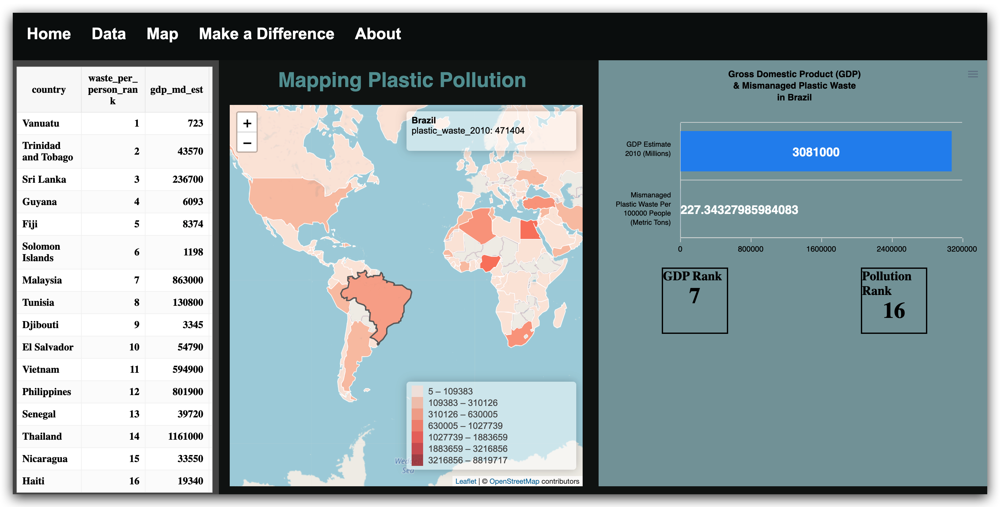

# Final Projects

Music, art, Asian American history, pollution, climate change, mental health, education policy... What do they all have in common? Well, a web map of course! What better way to visually communicate research than through the use of an interactive map that communicates data through narratives. In this digital humanities course at UCLA, students with little to no prior web development experience learned how to build full-fledged mapping applications from scratch, without using any off-the-shelf products. In just 10 weeks, students learned the basics of HTML, Javascript and CSS, and used entirely open source solutions to build narrative based maps that informed on their research interests.

## The Musical Maps: Music During the Pandemic
Justis Guardia, Daniel Liu, Kai Watanabe

Our project showcases an interactive map illustrating the listening trends and shifts between the years 2019 and 2020. This shows how the COVID-19 pandemic affected the ways in which users listened to music. This is shown through our data points that represent the concerts that occurred internationally during this time.

- [Project website](https://justisg.github.io/TheMusicalMaps/Website/index.html)
- [Project presentation](https://docs.google.com/presentation/d/1SvJS64kwBieYeTzDD-1OTlTT0BcoMr9YNXD17KQwKBc/edit?usp=sharing)

## Datart
Annmarie Cong, Eustina Kim, Michelle Lee

Datart is a digital mapping website depicting the progression of Los Angeles public art throughout time. Our dataset included over 1,500 art pieces dated from 1925-2017. To visualize our data, we developed various maps, charts, and image galleries. We also implemented other cool features to make it more interactive and exciting to users.

- [Project website](https://kimjee8955.github.io/Datart/)
- [Project presentation](https://docs.google.com/presentation/d/1N5JeIMyqX-Y78zTXRjocvzJKJLpu5dnQ8uFrkdFqvUU/edit?usp=sharing)

## Happy Tweet
Ivan Ma, Josephine Meyer-Hogan, MJ Howland

Happy Tweet is a website focused on digging deeper into the connection between social media and happiness levels. We are interested in seeing how emotions are expressed in social media, specifically via Twitter for the purpose of seeing if there is any correlation between happiness scores and Twitter content.

- [Project website](https://ivanma9.github.io/HappyTweet/)
- [Project presentation](https://docs.google.com/presentation/d/1GlYSQ-yxZvzY-zJ1iO6JjAlE0tEquWPCZ84ysuQH5dA/edit?usp=sharing)
- [Project proposal](https://github.com/ivanma9/HappyTweet/blob/main/Group%20Assignments/FinalProjectProposal.md)

## Environmental Racism in Carceral California
Hannah Lien, Julia Tanenbaum, Lisa Kahn

This project's website shows the severe presence of multiple environmental hazards throughout California, the location and overwhelming number of prison facilities throughout California, and the correlation between prison locations and environmentally toxic regions. We hope that visualizing this correlation will encourage site visitors to think about how prison abolition, climate justice, and environmental racism are interlinked.

- [Project website](https://jmtanenbaum.github.io/DHEnviroIncarceration/index.html)
- [Project presentation](https://docs.google.com/presentation/d/1cdXKsVTubNpTduznyoZ_4jy7YQgiwdkm3kIZvvFpCP8/edit?usp=sharing)

## How GDP Affects Mismanaged Plastic Waste
Derek Wang, Eli Aranita, Julia Wood

We wanted to look at mismanaged plastic waste worldwide, initially we were interested to develop our narrative around fishing and plastic pollution. However, we transitioned to analyzing how a country's Gross Domestic Product (GDP) affects their mismanaged plastic waste.

- [Project website](https://eliaranita1.github.io/project1/landing.html)
- [Project presentation](https://docs.google.com/presentation/d/1KTLVA4ByiMWpaApIkvuRMF43R9kHoaiLUBNr7oBuCMc/edit?usp=sharing)

## Rethink Recycle
Alice Lu, Hozumi Oshida, Emily Chau

The goal of Rethink Recycle is to help users understand the scope of the global waste-management network. The true impact of plastic waste goes beyond sorting one’s recycling; our goal is that Rethink Recycle will make this reality clearer and will provide visitors with resources.

- [Project website](https://hoz-map.github.io/Rethink-Recycling/Final/index.html)
- [Project presentation](https://docs.google.com/presentation/d/1DOM3XKQOHfRtOymrQ2DXA2nAqK4sXcdHTifmsDq0sRM/edit?usp=sharing)

## The Weight of Data
Ryan Orlando, Ainsleigh Douglas, Sebastien Dills

Our final project looks at the usage of the internet, data, and data centers and how this technology impacts the environment around the world. We added several features aimed to engage the user and educate them on the connection between data and carbon emissions. We hope that this site will inspire users to think more about their impact on the environment as they use the internet.

- [Project website](https://ainsleighdouglas.github.io/DH-151/Final/landing.html)
- [Project presentation](https://docs.google.com/presentation/d/1MgcGNnUJ47qQ94GmZa1M9Wp6hgm020YfX5VppbfEhMY/edit#slide=id.g63da1a4385_0_0)

## State-of-the-Climate
Natasha Grace, Zona Liao, Alekhya Vittalam

Using geospatial data sets of different countries, our group focuses on mortality rates as a result of varying levels of air pollution. Household air pollution was responsible for 3.8 million deaths around the world (World Health Organisation, 2016). We feel that creating a visual location guide could help us gain a clearer understanding as to where air quality could be detrimental for most and the socioeconomic reasons behind it. Income levels are directly related to the access the country has to making environmental decisions (prioritising profits over less pollution) and then subsequently, how sheltered the people are to being exposed to these potential risks (healthcare, discrimination).

- [Project website](https://alekhyavittalam.github.io/state-of-the-climate/FinalProject/index.html)
- [Project presentation](https://docs.google.com/presentation/d/1vJI6KaQS6iuJIr4hdw6RsmiESZR35APG3He8JVSB6ok/edit?usp=sharing)

## Mental Health in Los Angeles County
Frida Barragan & Kate McInerny

We used geographical data to explore the current mental health crisis in Los Angeles County. We mapped mental health facilities and intersected this data with demographic and income information. We also included interactive features such as a landing page, buttons and timelines to capture the user's interest.

- [Project website](https://frida-barragan.github.io/DH151/final/landingpage/index.html)
- [Project presentation](https://docs.google.com/presentation/d/1xnqlLzOxQjcZvmLTWbd6GFSU9sg5aLXFYyXpovh7Rp4/edit?usp=sharing)

## Mapping U.S. Art Education
Alex Haddad & Kai Colorado

Our project explores arts education within the American education and legislative system. We mapped arts education policies and standardized test scores across the United States to visualize the patterns and differences in arts education and academic performance across different states.

- [Project website](https://kaicolorado.github.io/DH151-Group/)
- [Project presentation](https://docs.google.com/presentation/d/1b6Eqx0KU_Fk9vo7tS-cTa3d5hFpzTms8_HCHiXa-n4Q/edit#slide=id.gdeec663fa4_1_187)

## History and Hate
Labiba Alam, Haiqi, Adriana Romero, Lynn Tieu

Our map showcases important events in Asian American history and anti-Asian hate incidents that have occurred over the past year. We hope our website encourages people to think holistically about Asian American hate in the U.S. and remain aware.

- [Project website](https://lynnt2.github.io/FantasticFour/Midterm/index.html)
- [Project presentation](https://docs.google.com/presentation/d/10Nuee1YaoXfA8vkx6ApehIzqA01WqUKmP-a9GIpFDDg/edit?usp=sharing)

