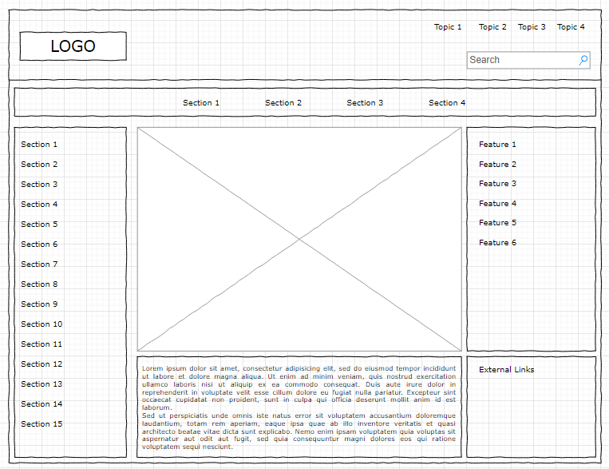

# Group Assignment #2 Storyboarding

Your second group assignment is to submit a storyboard of your web map.

The storyboard much include the following:

- Site map: An over arching wireframe of the site structure that includes all key pages
- A sketch of the maproom layout (grid size, spacing, headers/sidebars/footers, content areas, images placeholders) and its intended features (buttons, menus, etc)
- Annotations: notes on aspects that are not obvious visually, such as usability elements and possible interactions
- Interactivity: use wireframes to convey interactive components

Suggested tools:

- sketch by hand, scan or take photo and upload
- [draw.io](https://app.diagrams.net/): A google drive enabled drawing tool
- Google Sheets
