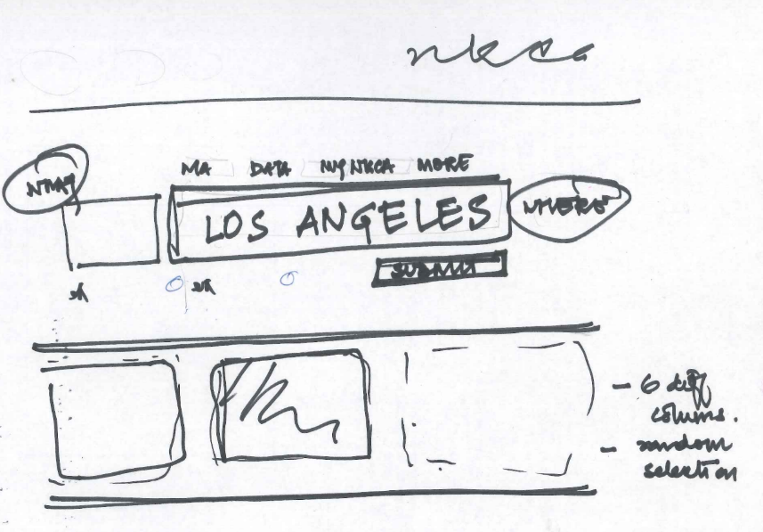

# Group Assignment #2 

## Part 1: Data plan update

It is time to narrow down on your datasets. Submit a data plan that includes the following:

- List all datasets (with links) that you intend to use in your project
- Include a short description no how the data will be used (ex. "Data will be downloaded as a csv file from _link_ and geocoded using Python. Each category of data by _fieldname_ will be a separate layer on the map assigned with a different color icon, and toggles will allow users to turn them on/off. Narratives will be driven by combining _fieldnames_ and be available as a popup box as users hover over individual icons.")

## Part 2: UX Design

Your second group assignment is to submit a UX Design report of your web map project.

The report must include the following:

- Mindmaps from each group member, and brief reactions
- Crazy eights from each group member, and brief reactions
- A storyboard collection with wireframes
    - Site map: An over arching wireframe of the site structure that includes all key pages
    - A sketch of the maproom layout (grid size, spacing, headers/sidebars/footers, content areas, images placeholders) and its intended features (buttons, menus, etc)
    - Additional sketches of specific functions/areas of the site as necessary
    - Annotations: notes on aspects that are not obvious visually, such as usability elements and possible interactions
    - Interactivity: use wireframes to convey interactive components

Suggested tools:

- sketch by hand, scan or take photo and upload
- [draw.io](https://app.diagrams.net/): A google drive enabled drawing tool
- Google Sheets

Submission:

- create a "storyboard.md" file in your group repo, and submit a link to it [here](https://github.com/yohman/21S-DH151/discussions/33). Make sure to include your group name and group members in the discussion post.
