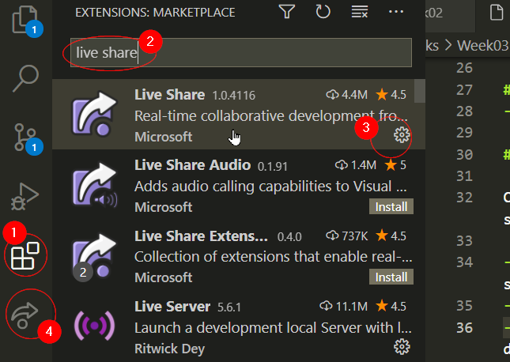
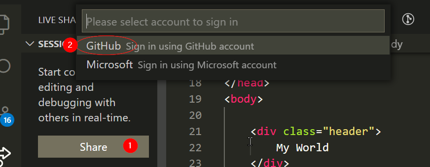
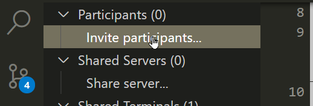
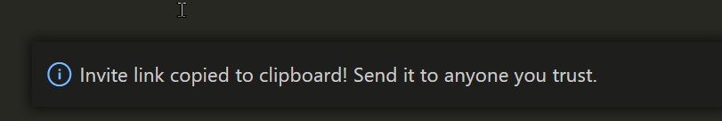

# How to install and use LiveShare

LiveShare is a VS Code extension that allows you to collaboratively code (like a Google Doc).

Install [Live Share](https://marketplace.visualstudio.com/items?itemName=MS-vsliveshare.vsliveshare)

Click on the Live Share button (number 4 above), click "share" and select github to login.

Click on Invite participants, confirm that the link has been put in the clipboard, and send the link to your partners.

