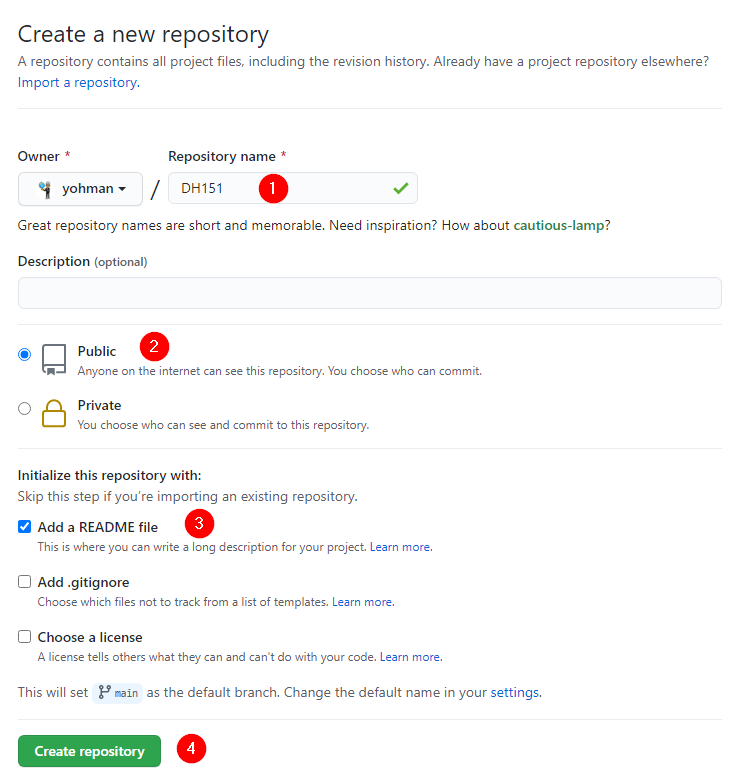
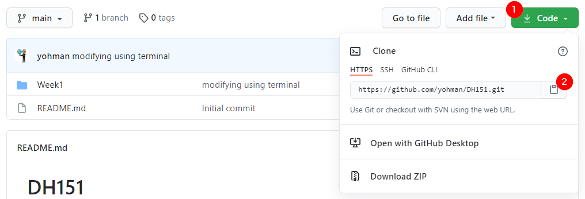
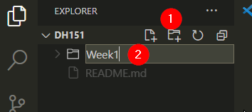
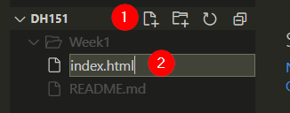
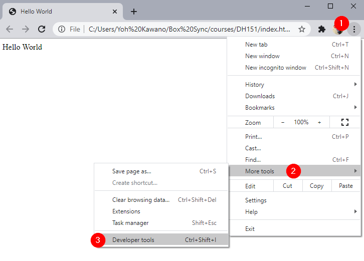

# Lab 1: Let's make an interactive web map

## Set up your class GitHub repo

First, we need to make sure you have a GitHub account, and a dedicated repo for this course.

Go to your GitHub page, click on "Repositories" and "New."

Enter the following information:

<kbd></kbd>

On GitHub, go to your course repo (should look something like this: <https://github.com/yohman/21S-DH151>).

Copy your repo URL

<kbd></kbd>

## Set up VSCode

Open VS Code

In your Welcome window, (1) click on `clone repository`, and (2) enter your repo url in the text box.

<kdb></kbd>

If you are prompted to open the repository, do so.

Click on the (1) `New folder` icon, and enter `Week1`

<kbd></kdb>
	
Click on the (1) `New file` icon, and enter `index.html`

<kbd></kbd>

Enter the following code:

```html
<!DOCTYPE html>
<html>
<head>
	<title>Hello World</title>
	<meta charset="utf-8" />

	<!-- style sheets -->
	<link rel="stylesheet" href="css/style.css">

</head>
<body>

	<div class="header">
		Hello World
	</div>
	<div class="sidebar">
		
	</div>
	<div class="content">

	</div>

</body>
</html>
```

> What do you observe in the code? 
> 1. Define the three top level elements
> 2. How do you write comments in HTML?
> 3. What do you think is a stylesheet?
> 4. What are classes?

Save the file and open it in chrome. Hint: right click on your `index.html` file and `reveal in file explorer`. Then, double click on the file.

> What do you see in the browser?
> 1. What happens if you change the "Hello World" text to something else?
> 1. Where did your sidebar and content go?

Open the Developer tools

<kbd></kbd>

