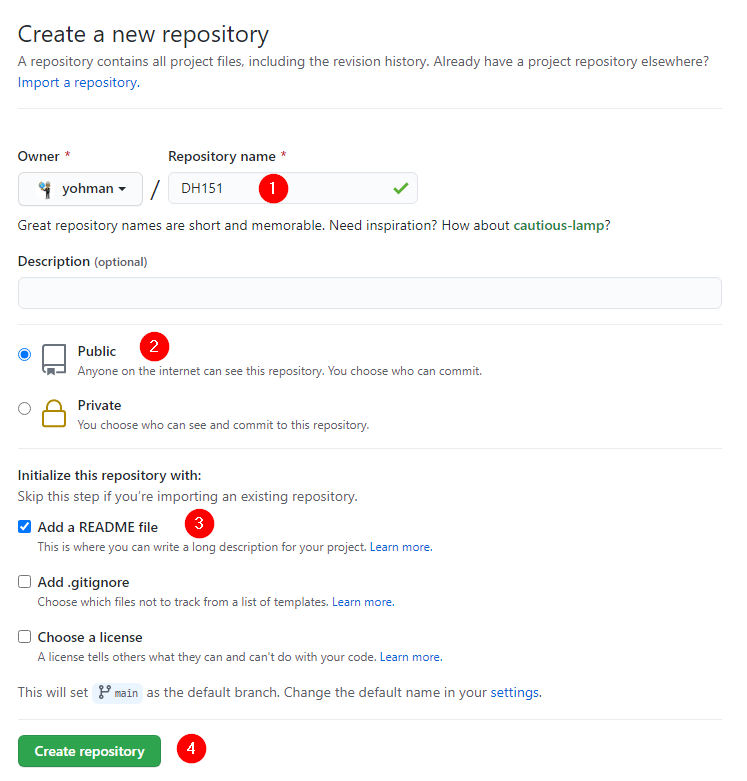
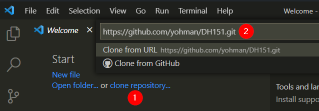
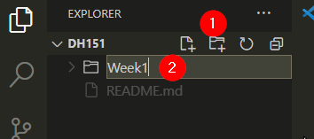
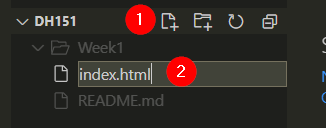
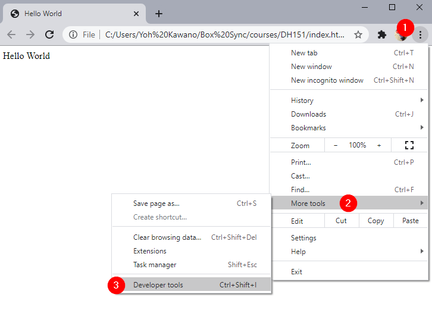
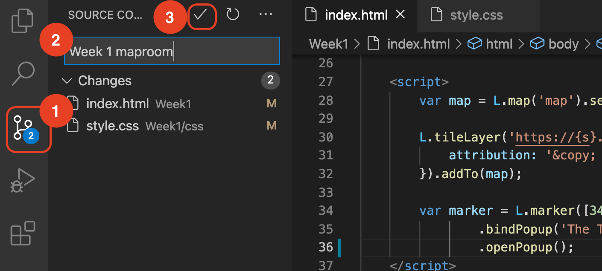
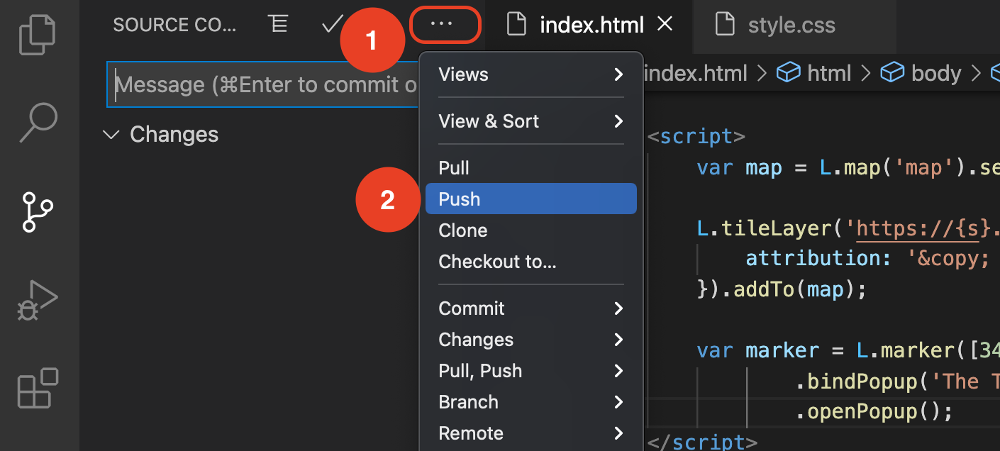

# Lab 1: Let's make an interactive web map

## Set up your class GitHub repo

First, we need to make sure you have a GitHub account, and a dedicated repo for this course.

Go to your GitHub page, click on "Repositories" and "New."

Enter the following information:

<kbd></kbd>

On GitHub, go to your course repo (should look something like this: <https://github.com/yohman/21S-DH151>).

Copy your repo URL

<kbd></kbd>

## Set up VSCode

Open VS Code

In your Welcome window, (1) click on `clone repository`, and (2) enter your repo url in the text box.

<kdb></kbd>

If you are prompted to open the repository, do so.

Click on the (1) `New folder` icon, and enter `Week1`

<kbd></kdb>
	
Click on the (1) `New file` icon, and enter `index.html`

<kbd></kbd>

Enter the following code:

```html
<!DOCTYPE html>
<html>
<head>
	<title>Hello World</title>
	<meta charset="utf-8" />

	<!-- style sheets -->
	<link rel="stylesheet" href="css/style.css">

</head>
<body>

	<div class="header">
		Hello World
	</div>
	<div class="sidebar">
		My Sidebar
	</div>
	<div class="content">
		My Map
	</div>

</body>
</html>
```

> What do you observe in the code? 
> 1. Define the three top level elements
> 2. How do you write comments in HTML?
> 3. What do you think is a stylesheet?
> 4. What are classes?

Save the file and open it in chrome. Hint: right click on your `index.html` file and `reveal in file explorer`. Then, double click on the file.

> What do you see in the browser?
> 1. What happens if you change the "Hello World" text to something else?
> 1. Where did your sidebar and content go?

Open the Developer tools as shown below (or Ctrl+Shift+I)

<kbd></kbd>

Click on the `console` tab

> What do you see in the console?
> How may you fix the error?

## Create a css stylesheet file

As noted, the html code assumes you have a css file.

Create a new folder named "css" inside your `Week1` folder.

Create a new file named `style.css` in the `css` folder

Enter the following code:

```css
body,html {
	margin:0;
	height:100%;
	width:100%;
}

#map {
	height: 100%;
}

body {
    display: grid;
	grid-template-rows: 80px 1fr;
	grid-template-columns: 250px 1fr;
	grid-template-areas: 
	"header header"
	"sidebar content";
}

.header {
	grid-area: header;
	padding:10px;
    background-color: #333;
}
.sidebar {
	grid-area: sidebar;
	padding:10px;
    background-color: #555;
}
.content {
	grid-area: content;
}
```

Save the file, and refresh your browser page that has `index.html`

> How did the css file affect the page?
> 1. The text in your header is now black on a dark background. Change the text color to white (hint: use `font-color`)
> 1. Choose colors of your liking, and modify the `background-color` values for your `header` and `sidebar`
> 1. Modify the `font-color` appropriately so that there is enough contrast between the text color and the background color.

## Map time!

Now it is time to add a map to our html page. This is a multi-step process that entails the following:

1. Bring the leaflet javascript library into the html page
1. Bring the leaflet css into the html page
1. Add a `<div>` to put the map in
1. Add leaflet code to create the map

Take a moment to observe the [leaflet](https://leafletjs.com) website.

### Part 1: Bring in leaflet
We can bring the leaflet javascript and css libraries into our html page using a [cdn](https://leafletjs.com/download.html)

Put the following code in the `<head>` area of your `index.html` file.

```html
<!-- leaflet -->
<link rel="stylesheet" href="https://unpkg.com/leaflet@1.7.1/dist/leaflet.css" />
<script src="https://unpkg.com/leaflet@1.7.1/dist/leaflet.js"></script>
```
> Did you remember to indent your code? Unlike, say, Python, html indentation is not required, but it is always a good idea to keep your code "clean" by following indentation standards throughout your code

### Part 2: Create a map div

Replace the "My Map" text in your `content` div with the following:

```html
<div id="map"></div>
```

### Part 3: Javascript time

Now we are finally ready to create our interactive web map. Remember that interactive web development uses Javascript, so we first need to create a space in our html page that allows us to write javascript code.

Inside the `<body></body>` tags, and right after that last closing `</div>` tag, enter the following:

```html
<script>
	alert('hello javascript alert!')
	console.log('hello console!')
</script>
```

> Save the file, and refresh the page in your browser. 
> 1. What happens?
> 1. Open your developer tools/console window. Do you see your message?

### Part 4: Leaflet javascript

Delete the alert and console lines. Add the following leaflet "starter" code inside the `<script></script>` tags:

```javascript
var map = L.map('map').setView([34.0697,-118.4432], 17);

L.tileLayer('https://{s}.tile.openstreetmap.org/{z}/{x}/{y}.png', {
	attribution: '&copy; <a href="https://www.openstreetmap.org/copyright">OpenStreetMap</a> contributors'
}).addTo(map);

var marker = L.marker([34.0697,-118.4432]).addTo(map)
		.bindPopup('The Technology Sandbox<br> Where Yoh is sitting this very moment')
		.openPopup();	
```

> ### Make it your own
> Now that you have command over your maproom, modify it and make it your own. Try:
> 1. Change the map marker location to a place of your interest
> 1. Add relevant content in the header and sidebar sections
> 1. Change the colors in the stylesheet, and if you are adventurous, change other stylesheet parameters
> 1. Add more markers to the map, with appropriate popup content

## Push your new files to your GitHub repo

Now that you are satisfied with your _local_ version of your maproom, it is time to add it to your GitHub repo.

VS Code comes replete with GitHub features. Let's take full advantage of them. 

1. Click on the `Source Control` tab, check that you have files that have been added/modified, and then
1. add a message text for your commit, and
1. commit your changes by clicking on the checkbox icon.

<kbd></kbd>

There is one step left. You have just commited your changes to your _local_ repo. You need to **push** your changes to your _online_ GitHub repo. 

1. Click on the "more actions" button (triple dot)
1. Click on `Push`

<kbd></kbd>
