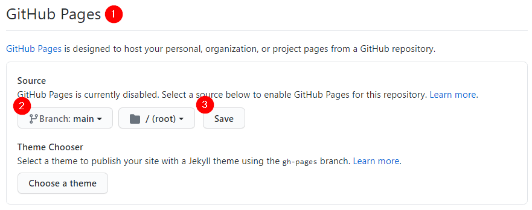
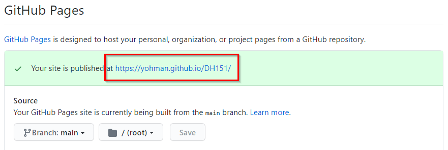

# Setup for the course
You will need:

1. a GitHub account (you should already have one)
1. a GitHub repository for the course
1. enable GitHub Pages
1. Git installed on your computer (below)
1. Visual Studio Code installed on your computer (below)

## Create a GitHub repository for this course

First, we need to make sure you have a GitHub account, and a dedicated repo for this course.

Go to your GitHub page, click on "Repositories" and "New"

Enter the following information:

<kbd></kbd>

Confirm that your repository has been created.

## Enable GitHub Pages

1. In your GitHub class repo (should be something like this: https://github.com/yohman/DH151), go to `Settings`
2. Scroll down until you see the section for **GitHub Pages**
1. Choose the `main` branch and save

	<kbd></kbd>

1. Scroll down again to the GitHub Pages setting, and take a note of your new "Pages" url:

	<kbd></kbd>


## Install Git

- https://git-scm.com/

For MacOS, choose the "homebrew" option (it takes about 10-15 mins to install homebrew)

Once homebrew is installed, Open terminal and enter the following command:

`$ brew install git`

When git is installed, check your installation:

`git --version`

## Install VS Code

- Install the text editor [Visual Studio Code](https://code.visualstudio.com/download)

## Set the Git configuration

Open a terminal window and enter the following with your credentials:

	```PowerShell
	git config --global user.name "John Doe"
	git config --global user.email johndoe@example.com
	```
	
