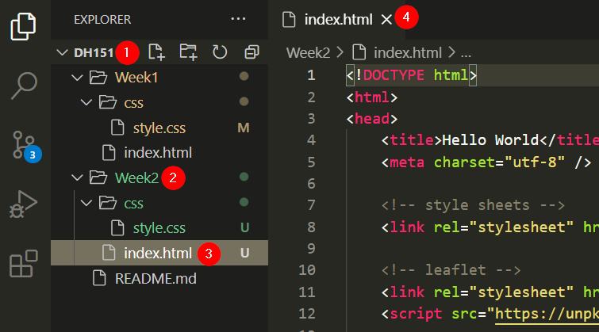
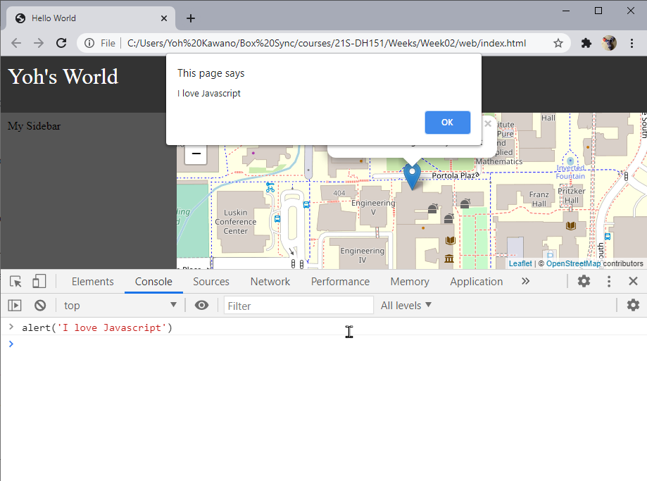

# Week 2 Lab

To begin, copy the maproom files you created from your Week 1 lab into a Week2 folder.

1. Open VSCode and make sure you have your `DH151` repository open
1. Create a `Week2` folder
1. Copy your `Week1/index.html` file and the `Week1/css` folder to your `Week2` folder
1. Open the `Week2/index.html` file

<kbd></kbd>

## If you lost your week 1 files (skip if the steps above worked)
If you do not have your Week1 files (you should!), not to worry, you can recreate them.

1. Open VSCode and make sure you have your `DH151` repository open
1. Create a `Week2` folder
1. Create a new file titled `index.html` in your `Week2` folder, and paste the following code:
    ```html
    <!DOCTYPE html>
	<html>
	<head>
		<title>Hello World</title>
		<meta charset="utf-8" />

		<!-- style sheets -->
		<link rel="stylesheet" href="css/style.css">

		<!-- leaflet -->
		<link rel="stylesheet" href="https://unpkg.com/leaflet@1.7.1/dist/leaflet.css" />
		<script src="https://unpkg.com/leaflet@1.7.1/dist/leaflet.js"></script>

	</head>
	<body>

		<div class="header">
			My World
		</div>
		<div class="sidebar">
			My Sidebar
		</div>
		<div class="content">
			<div id="map"></div>
		</div>

		<script>
			var map = L.map('map').setView([34.0697,-118.4432], 17);

			L.tileLayer('https://{s}.tile.openstreetmap.org/{z}/{x}/{y}.png', {
				attribution: '&copy; <a href="https://www.openstreetmap.org/copyright">OpenStreetMap</a> contributors'
			}).addTo(map);

			var marker = L.marker([34.0697,-118.4432]).addTo(map)
					.bindPopup('The Technology Sandbox<br> Where Yoh is sitting this very moment')
					.openPopup();	

		</script>


	</body>
	</html>
	```
1. Create a `css` folder in your `Week2` folder
1. Create a `style.css` file in your `Week2/css` folder
1. Enter the following css code in your `style.css` file:
	```css
	body,html {
		margin:0;
		height:100%;
		width:100%;
	}

	#map {
		height: 100%;
	}

	body {
		display: grid;
		grid-template-rows: 80px 1fr;
		grid-template-columns: 250px 1fr;
		grid-template-areas: 
		"header header"
		"sidebar content";
	}

	.header {
		grid-area: header;
		padding:10px;
		background-color: #333;
		color: white;
		font-size: 2em;
	}

	.sidebar {
		grid-area: sidebar;
		padding:10px;
		background-color: #555;
	}

	.content {
		grid-area: content;
	}
	```

## Check your setup

1. Right click on `Week2/index.html` and click "Reveal in File Explorer"
1. Open the file in Chrome and confirm that you have an interactive leaflet map.

# Javascript basics

In your Chrome browser, you should now see your index.html file with a fully interactive leaflet map.

When loading a web page which is associated with one or more scripts, the JavaScript code is automatically interpreted and executed by the browser. We can also manually interact with the browser’s interpreter or engine using the JavaScript console, also known as the command line, which is built into all modern web browsers. The console is basically a way to type code into a computer and get the computer’s answer back. This is useful for experimenting with JavaScript code, such as quickly testing short JavaScript code snippets. It is exactly what we are going to do.

## Developer's tools

Open the developer's tools (ctrl-shift-i) and select the console tab.

Enter the following javascript code (feel free to change the message):

```js
alert('I love Javascript')
```
<kbd></kbd>

How about some math:

```js
1 + 1
```

>Experiment with other arithmetic features. What can and can it not do?

### Variables

Variables can be declared in three ways.

```js
var d1 = "I am a var variable, and I am old school";
let d2 = "I am a let variable, the new and cool way to define variables";
const d3 = "I am a const variable, and you can't change me";
```


### Data types

#### Strings: Single or double quotes

```js
let s1 = 'Mapping' // I am a string
let s2 = 'is fun' // I am also a string
```

Concatenation

```js
s1 + s2
```

> This results in `Mappingis fun`. How do you fix the sentence?


Adding to existing strings
```js
html = '<h1>My Map</h1>'
html += '<ul>'
html += '<li>Osaka</li>'
html += '<li>Bangkok</li>'
html += '<li>Tokyo</li>'
html += '<li>Los Angeles</li>'
html += '</ul>'
```

#### Numbers

```js
let x = 10;
let y = 3;
```
Variables can do math too!
```js
x*y
```

> Question: What happens when you add a string to a number? (ex. `s1 + x`)


#### Arrays: Square brackets `[]`

```js
let cities = ['Osaka','Bangkok','Tokyo','Los Angeles']
```
How many values (length)?
```js
cities.length
```
Getting specific array values. Note that array count begins with "0" and not "1"
```js
cities[0]
cities[1]
cities[2]
cities[3]
```
#### Objects: Squiggly brackets `{}`
A javascript object is a great way to store a collection of data in `key:value` pairs.

```js
let city = {
	'title':'Hello Osaka',
	'lat': 34.6937,
	'lon': 135.5023
};
```

Grab "values" by requesting its key:

```js
city.title
```


#### Objects in Arrays
By putting objects with identical key:value pairs, we can begin to construct a data table.
```js
let data = [
	{
		'title':'Osaka',
		'lat': 34.6937,
		'lon': 135.5023
	},
	{
		'title':'Cali',
		'lat': 3.4516,
		'lon': -76.5320
	},
	{
		'title':'Bangkok',
		'lat': 13.7563,
		'lon': 100.5018
	},
	{
		'title':'Tokyo',
		'lat': 35.6762,
		'lon': 139.6503
	},
	{
		'title':'LA',
		'lat': 34.0522,
		'lon': -118.2437
	}
]
```

Challenge questions:
1. How do you get specific array objects?
1. Get the latitude coordinate for Tokyo using javascript code

### Loops

Looping allows you to *iterate* through an array.

Loop through an array:

```js
// loop through cities
cities.forEach(function(item){
	console.log(item)
});
```

Loop through an array of objects:
```js
// loop through data
data.forEach(function(item){
	console.log(item)
});
```

You can choose to return *specific* elements from each data object.

```js
// loop through data
data.forEach(function(item){
	console.log('The latitude for ' + item.title + ' is ' + item.lat)
});
```
Challenge exercise:
1. Add a `description` key to the data array objects, and enter a sentence per city.
1. Loop through each data object, and create the following statement for each city: 

`The coordinates for _city_ are _lat_, _lon_. _City_ is _description_.`

## In-class Exercise (also your individual assignment)

Now it is your turn to put all this newfound javascript knowledge into practice.

1. In your `index.html` file, and in the javascript section of your code (`<script></script>`), create an array of objects that lists locations that you have travelled to (include at least 5 locations). Make sure to include a title, description, latitude, and longitude for each.
1. Replace the code that generates the single marker with a loop that goes through your array of objects. Then, create a marker for each location. Make sure to include a title and description in the popup.
1. Add a title of your maproom in the header section.
1. Add a title and description of your map in the sidebar section.
1. When you are done, upload your additions to your GitHub Repo ([follow these instructions to commit and push from the week 1 lab](https://github.com/yohman/21S-DH151/tree/main/Weeks/Week01/Lab#push-your-new-files-to-your-github-repo))
1. Submit the GitHub Pages URL to your maproom in the class discussion section [here](https://github.com/yohman/21S-DH151/discussions/18)

**Bonus**: Add an image for each city in your narrative.
