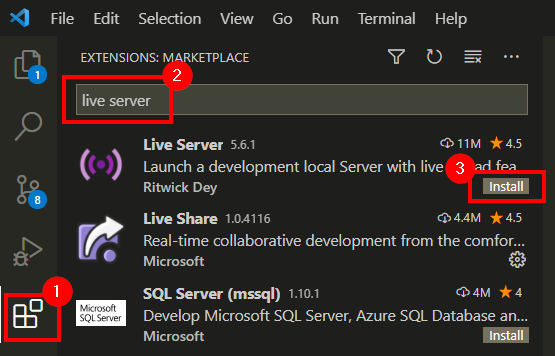
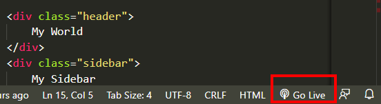
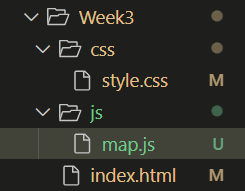
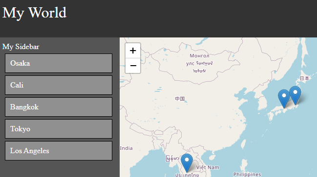
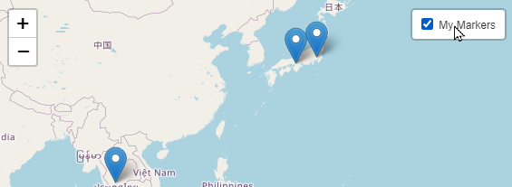

# Week 3 Lab

## Getting started

### Install Live Server

Live Server is a great VSCode extension that allows you to see your html code on a local browser window.

1. Click on the extensions tab
1. Enter "live server" in the search box
1. Click on the install button next to Live Server

<kbd></kbd>

Once installed, open an .html file, and click on the "go live" button.

<kbd>

## Starter files

To begin, copy the maproom files you created from your Week 2 lab into a Week3 folder.

1. Copy and paste your `Week2` folder, and rename `Week2 copy` to `Week3`
1. Alternatively, create a `Week3` folder, and copy and paste the files from [here](starter/).

## Moving javascript to its own

Your javascript has grown up. It is time to let it go and live on its own. In your `Week3` folder, create a `js` folder, and create a file `map.js`.

<kbd></kbd>

Cut and paste all the javascript code that resides inside the `<script></script>` tags, *without* the `script` tags, and paste it into your new `map.js` file. Indent as necessary.

Next, in the `index.html` file, replace the now empty `<script></script>` tags with the following:

```js
<!-- map javascript -->
<script src="js/map.js"></script>
```
Your `index.html` file should now have no javascript in it, and only have about 35 lines of html code in it.

Your web file structure should now be:

```
+-- Week3
    +-- css
	    +-- style.css
	+-- js
		+-- map.js
	index.html
```

### Add jQuery
What is [jQuery](https://jquery.com/)?
> jQuery is a fast, small, and feature-rich JavaScript library. It makes things like HTML document traversal and manipulation, event handling, animation, and Ajax much simpler with an easy-to-use API that works across a multitude of browsers. With a combination of versatility and extensibility, jQuery has changed the way that millions of people write JavaScript.

Add jQuery (v3.6.0 at the time of this writing) using the CDN (link provided [here](https://code.jquery.com/)) to the `<head></head>` area of your `index.html` file.

```html
<!-- jquery -->
<script src="https://code.jquery.com/jquery-3.6.0.min.js" integrity="sha256-/xUj+3OJU5yExlq6GSYGSHk7tPXikynS7ogEvDej/m4=" crossorigin="anonymous"></script>
```

### Selecting elements
jQuery makes it easy to select elements (like a `<div>`) and do *something* with it. Let's experiment using your browser's developer tools.
1. Open `Week3/index.html` in a chrome browser (if you installed the "Live Server" extension, you can click on the "Go Live" button)
1. Access the developer tools (ctrl/command+shift+i), and select the console tab

#### Selecting elements by class name

Our `index.html` file has elements with `class` attributes in them. A `class` is a way to identify an element in your website. You should have div's with the following `class` attributes:
- header
- sidebar
- content

Let's do some magic. Note that selecting a class element uses the dot `.` notation:

```js
$('.header').hide()
```
Wow! Now take a wild guess, and figure out how to bring the header back.

```js
$('.header').show()
```

Try these other fun ones:

```js
$('.header').fadeOut()
```
```js
$('.header').fadeIn()
```
You can also manipulate the content.
```js
$('.header').prepend('Hello!')
```
```js
$('.header').append('Goodbye!')
```
```js
$('.header').html("I'm a brand <b>new</b> header!")
```
Try these functions on the sidebar as well.

#### Selecting elements by id
Your `index.html` file has one div with an `id` attribute:
- map

Selecting an element by id uses a hashtag `#` notation:

```js
// fade out slowly, like 1000 milliseconds
$('#map').fadeOut(1000)
```
```js
// fade in slowly, like 2000 milliseconds
$('#map').fadeIn(2000)
```

> **NOTE**: Remember, `.` for classes, and `#` for ids. This notation is the same for stylesheet declarations, which we will cover later.

### Adding dynamic content to the sidebar

<kbd></kbd>

So how is all this useful for our maproom? While we learned how to add markers from an array of objects, we can use the same logic to add content to the sidebar.

If you were successful in your Week 2 lab, you should have a loop in your code that looks like this:

```js
// loop through data
data.forEach(function(item){
	// add marker to map
	let marker = L.marker([item.lat,item.lon]).addTo(map)
		.bindPopup(item.title)
})
```

You can use this same loop to add content to the sidebar:

```js
// loop through data
data.forEach(function(item){
	// add marker to map
	let marker = L.marker([item.lat,item.lon]).addTo(map)
		.bindPopup(item.title)

	// add data to sidebar
	$('.sidebar').append(item.title)
})
```
Notice how `.append` adds the title of each location to the sidebar, but it does not consider text spacing, new lines, or layout. 

Let's create a "card" like style for each item in the sidebar. To do so, wrap the content in a `<div></div>` container, adding a class attribute `class="sidebar-item"` so that we can style it later. Also notice how we are concatenating string values with variables (yes, it's getting complicated):

```js
// loop through data
data.forEach(function(item){
	// add marker to map
	let marker = L.marker([item.lat,item.lon]).addTo(map)
		.bindPopup(item.title)

	// add data to sidebar
	$('.sidebar').append('<div class="sidebar-item">'+item.title+'</div>')
})
```
Next, we need to create a css entry in our stylesheet to style our divs with class `sidebar-item`.

Add the following css in your `Week3/css/style.css` file:

```css
.sidebar-item {
    padding: 10px; /* adds inner padding */
    background: gainsboro; /* background color */
    border: 1px solid gray; /* border width, style, and color */
    margin: 5px; /* outer padding */
}
```
Refresh your page in your browser to see your new css style applied to the sidebar elements. Take some time to adjust the css components to match your site design and layout.

## Adding an ID key

In order to easily identify each element in the data, create a unique ID field.

Modify the data objects and add an `id` key with unique identifyers:

```js

// let's create some data
let data = [
	{
		'id': 0,
		'title':'Osaka',
		'lat': 34.6937,
		'lon': 135.5023,
		'image': 'https://upload.wikimedia.org/wikipedia/commons/thumb/e/e4/Osaka_Castle_02bs3200.jpg/320px-Osaka_Castle_02bs3200.jpg'
	},
	{
		'id': 1,
		'title':'Cali',
		'lat': 3.4516,
		'lon': -76.5320,
		'image': 'https://upload.wikimedia.org/wikipedia/commons/thumb/e/e8/Pascual_Guerrero_U-20WC_2011_CMR-NZL.JPG/320px-Pascual_Guerrero_U-20WC_2011_CMR-NZL.JPG'
	},
	etc...
]
```

Now we know that we can access different objects in our data array in the following way:

```js
// to get the lat/lon for the first location
data[0].lat
data[0].lon
```

## On click events

The HTML `onclick` attribute allows you to assign an action to an element (like a `<div>`). Take a look at the loop that generated the cards in the sidebar, and add the following onclick event to each `<div>` in the loop `onclick=alert("you clicked me!")`.

```js
// loop through data
data.forEach(function(item){
	// add marker to map
	L.marker([item.lat,item.lon]).addTo(map)
		.bindPopup(item.title)

	// add data to sidebar
	$('.sidebar').append('<div class="sidebar-item" onclick="alert(\"you clicked me!\")">'+item.title+'</div>')
})
```

## Flying around the world

Alerts are fun, but what we **really** want the map to do is to *fly* to each location that is clicked. Leaflet has a snazzy feature that allows you to fly to any latitude/longitude in the world.

Let's try it out. Open the developer's tools console, and type the following command:

```js
map.flyTo([0,0],12)
```
Try to fly to other places, like the north/south pole.

## Creating a function

Next, let's create a function that *flies to* a location in our data by feeding it an id value.

*If you need a refresher on javascript function, read [this section of the textbook](https://geobgu.xyz/web-mapping2/javascript-basics.html#functions).*

```js
// function to fly to a location by a given id number
function flyByID(id){
	map.flyTo([data[id].lat,data[id].lon],12)

	// open the popup
	myMarkers.getLayers()[id].openPopup()
}
```

Now we need to activate this function as on `onclick` event from the sidebar. To do so, add the event to the code that generates the div in the sidebar:

```js
// loop through data
data.forEach(function(item){
	// add marker to map
	L.marker([item.lat,item.lon]).addTo(map)
		.bindPopup(item.title)

	// add data to sidebar with onclick event
	$('.sidebar').append('<div class="sidebar-item" onclick="flyByID('+item.id+')">'+item.title+'</div>')
})
```

## Using a `featureGroup` for your markers

Currently, we are mapping each marker, one at a time. Since our markers are part of a collection, it is adviced to put them in a leaflet `featureGroup`.

```js
// before looping the data, create an empty FeatureGroup
let myMarkers = L.featureGroup();

// loop through data
data.forEach(function(item){
	// create marker
	marker = L.marker([item.lat,item.lon]).bindPopup(item.title)

	// add marker to featuregroup
	myMarkers.addLayer(marker)

	// add data to sidebar with onclick event
	$('.sidebar').append('<div class="sidebar-item" onclick="flyByID('+item.id+')">'+item.title+'</div>')
})

// after loop, add the FeatureGroup to map
myMarkers.addTo(map)
```

## Zoom to the extent of your markers

Finally, the added benefit of putting markers in a `featureGroup` is that it allows you to fit the map view to the bounds of your markers with one line of code:

```js
// make the map zoom to the extent of markers
map.fitBounds(myMarkers.getBounds());
```
## Add a layer toggle box

<kbd></kbd>

Leaflet also comes with a nice feature that allows you to control your layers. While we only have one feature group to control, let's add it anyways. First, create an object of your layer:

```js
// define layers
let layers = {
	"My Markers": myMarkers
}
```

Then, add the control to the map:

```js
// add layer control box
L.control.layers(null,layers).addTo(map)
```


## Cleanup work

### CSS cleanup

`overlow: auto` makes the element scrollable with a scrollbar

```css
.sidebar {
	grid-area: sidebar;
	padding:10px;
	background-color: #555;
	overflow: auto; /* allows the sidebar to overflow with a scrollbar */
}
```

`cursor: pointer` makes the cursor style change when hovering over the element

```css
.sidebar-item {
    padding: 10px; /* adds inner padding */
    background: gainsboro; /* background color of the card */
    border: 1px solid gray; /* border width and color */
    margin: 5px; /* outer padding */
	cursor: pointer; /* change cursor to hand on hover */
}
```

### Layout

Simple layout changes can be made as well

`grid-template-columns` can be modified to your liking. Note that the `1fr` indicates the remainder of the space allocated. Here are some examples:

#### 400px split
```css
body {
	display: grid;
	grid-template-rows: 80px 1fr;
	grid-template-columns: 400px 1fr; /* change to 50/50 split */
	grid-template-areas: 
	"header header"
	"sidebar content";
}
```

#### 50/50 split and a taller header
```css
body {
	display: grid;
	grid-template-rows: 120px 1fr;
	grid-template-columns: 50% 50%; /* change to 50/50 split */
	grid-template-areas: 
	"header header"
	"sidebar content";
}
```

#### 50/50 split, a tall header, and the sidebar on the right
```css
body {
	display: grid;
	grid-template-rows: 120px 1fr;
	grid-template-columns: 50% 50%; /* change to 50/50 split */
	grid-template-areas: 
	"header header"
	"content sidebar"; /* swapped places */
}
```
