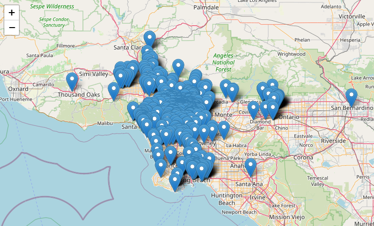
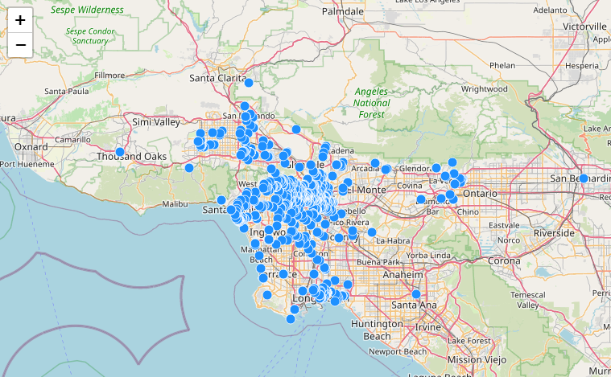
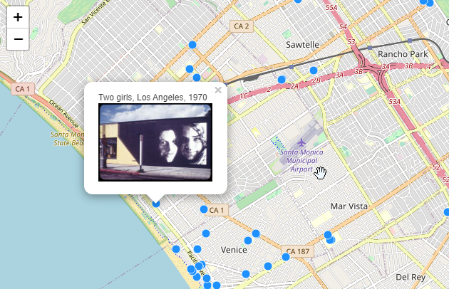

# Week 4 Lab

## Getting started

## Starter files

## Mapping CSV data

In previous labs, we have created our own data using javascript objects. Here, we will learn how to import data from a csv file.

### Import PapaParse

CSV is not natively supported by javascript. In order to import CSV, we will use an open source in-browser CSV parser library called [PapaParse](https://www.papaparse.com/).

To use PapaParse, download the source js file, and save it in your `Week4/js` folder:

- https://unpkg.com/papaparse@5.3.0/papaparse.min.js

Then, add the file to your `index.html` file in the header section:

```html
<script src="js/papaparse.min.js"></script>
```

### Create a csv file

Create a `Week4/data` folder. Download and add the `dunitz.csv` file from [here](data/dunitz.csv).

### Create a `readCSV()` function

First, add the path as a global variable in the `//global variable` section of `map.js`.

```js
// path to csv data
let path = "data/dunitz.csv"
```

Next, create a function that will read the csv file using PapaParse.

```js
// function to read csv data
function readCSV(path){
	Papa.parse(path, {
		header: true,
		download: true,
		complete: function(data) {
			console.log(data);
			
			// map the data
			mapCSV(data);

		}
	});
}
```

Note that the path can lead to a local file via a relative path, or it can be a csv file hosted on the web, like on a github account. To do so, make sure you link to the raw url link:


### Create the function to map the csv data

Notice that the `readCSV` function ends with a call to yet another function `mapCSV()`. Before we do so, let's see what the console tells us the data looks like.

```js
function mapCSV(data){
	let markers = L.featureGroup();
	data.data.forEach(function(item){
		let marker = L.marker([item.latitude,item.longitude])
		markers.addLayer(marker)
	})
	markers.addTo(map)
	map.fitBounds(markers.getBounds())
}
```


### Changing markers to circles

- [CircleMarker](https://leafletjs.com/reference-1.7.1.html#circlemarker)

```js
function mapCSV(data){
	let markers = L.featureGroup();
	data.data.forEach(function(item){
		let circleOptions = {
			radius: 5,
			weight: 1,
			color: white,
			fillColor: red
		}
		let marker = L.circleMarker([item.latitude,item.longitude],circleOptions)
		markers.addLayer(marker)
	})
	markers.addTo(map)
	map.fitBounds(markers.getBounds())
}
```


### Adding on hover event

```js
function mapCSV(data){
	let markers = L.featureGroup();
	data.data.forEach(function(item){
		let circleOptions = {
			radius: 5,
			weight: 1,
			color: white,
			fillColor: red
		}
		let marker = L.circleMarker([item.latitude,item.longitude],circleOptions)
		.on('mouseover',function(){
			this.bindPopup('hello').openPopup()
		})
		markers.addLayer(marker)
	})
	markers.addTo(map)
	map.fitBounds(markers.getBounds())
}
```


# Storyboard Exercise

## Part 1: Mindmap (5 minutes)

You have identified a problem, written up a proposal, identified preliminary datasets, and introduced a methodology for your project.

Begin to visualize the different components of the user experience: the user, the web interface, the interactions, the workflow, the navigation, and the end result. This is an individual exercise. With paper and pen, sketch the user experience as best as you can. No mind map will be the same. Some may be all images, all text, diagrams, arrows, illustrations, it's all good.

### Reflection (10 minutes)

Share your mindmap with your groupmates and vote on the elements that resonate with you.

## Part 2: Crazy Eights (10 minutes)

Get a piece of paper and fold it in half four times to get eight panels. Each panel is an "idea" that may or may not flow with the next panel. Sketch the idea (it might be the entire site, a search bar, an image, an interaction, etc). This is also an individual exercise, and each group member should create their own crazy eights.

### Reflection (10 minutes)

Share your crazy eight panels with your groupmates and vote on the elements that resonate with you.

## Part 3: Storyboard with Wireframing (20 minutes)

Now think of the site in a more complete sense. Sketch (or use your computer) to create at least three panels: First this, then this, and then that. Each panel does not need to be of the same element of your site. One panel may lead to a different element of your site that kicks you back out to the next panel. Describe each panel's components in as much detail as you can. Use annotations, bubbles notes, colors, etc.

This is a group exercise. You may choose to individually draw separate storyboard wireframes, or you may designate a "drawer" with everybody else contributing ideas as he/she sketches away.

- [source for inspiration](https://flickr.com/photos/soxiam/albums/224126/)
