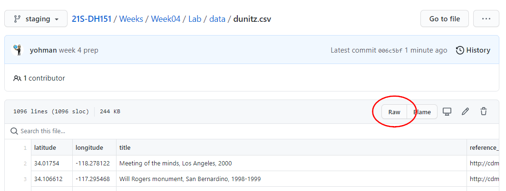

# Week 4 Lab

## Getting started

## Starter files

## Mapping CSV data

In previous labs, we have created our own data using javascript objects. Here, we will learn how to import data from a csv file.

### Import PapaParse

CSV is not natively supported by javascript. In order to import CSV, we will use an open source in-browser CSV parser library called [PapaParse](https://www.papaparse.com/).

To use PapaParse, download the source js file, and save it in your `Week4/js` folder:

- https://unpkg.com/papaparse@5.3.0/papaparse.min.js

Then, add the file to your `index.html` file in the header section:

```html
<script src="js/papaparse.min.js"></script>
```

### Create a csv file

Create a `Week4/data` folder. Download and add the `dunitz.csv` file from [here](data/dunitz.csv).

### Create a `readCSV()` function

First, add the path as a global variable in the `//global variable` section of `map.js`.

```js
// path to csv data
let path = "data/dunitz.csv"
```

Next, create a function that will read the csv file using PapaParse.

```js
// function to read csv data
function readCSV(path){
	Papa.parse(path, {
		header: true,
		download: true,
		complete: function(data) {
			console.log(data);
			
			// map the data
			mapCSV(data);

		}
	});
}
```

Note that the path can lead to a local file via a relative path, or it can be a csv file hosted on the web, like on a github account. To do so, make sure you link to the raw url link:



### Create the function to map the csv data

Notice that the `readCSV` function ends with a call to yet another function `mapCSV()`. Before we do so, let's see what the console tells us the data looks like.

```js
function mapCSV(data){
	let markers = L.featureGroup();
	data.data.forEach(function(item){
		let marker = L.marker([item.latitude,item.longitude])
		markers.addLayer(marker)
	})
	markers.addTo(map)
	map.fitBounds(markers.getBounds())
}
```
