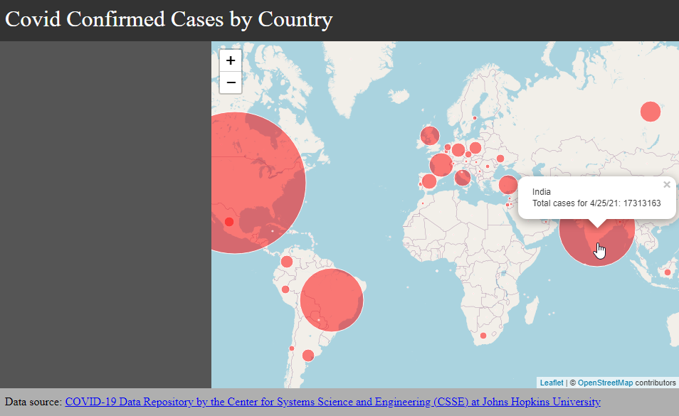

# Week 5 Lab


Welcome to week 5! As we gear ourselves to the midterm presentations, the purpose of this lab is to demonstrate the development of a project from start to finish. This lab will create a web map that shows the global growth of the covid 19 pandemic from start (being around January 2020) to present day. The data is brought in via a real-time feed from the [Johns Hopkins University Covid19 Data Repository](https://github.com/CSSEGISandData/COVID-19) on GitHub.

## Getting started

### Starter files

- starter files available [here](starter)

Or, you can create the files as indicated here:

### `Week4/index.html`

Notice the added `footer` class that include a link to the data source.

```html
<!DOCTYPE html>
<html>
<head>
	<title>World Covid Map</title>
	<meta charset="utf-8" />

	<!-- style sheets -->
	<link rel="stylesheet" href="css/style.css">

	<!-- leaflet -->
	<link rel="stylesheet" href="https://unpkg.com/leaflet@1.7.1/dist/leaflet.css" />
	<script src="https://unpkg.com/leaflet@1.7.1/dist/leaflet.js"></script>

	<!-- jquery -->
	<script src="https://code.jquery.com/jquery-3.6.0.min.js" integrity="sha256-/xUj+3OJU5yExlq6GSYGSHk7tPXikynS7ogEvDej/m4=" crossorigin="anonymous"></script>

	<!-- papaparse for csv data -->
	<script src="js/papaparse.min.js"></script>

</head>
<body>

	<div class="header">
		Covid Confirmed Cases by Country
	</div>
	<div class="sidebar">
		
	</div>
	<div class="content">
		<div id="map"></div>
	</div>
	<div class="footer">
		Data source: <a href="https://github.com/CSSEGISandData/COVID-19">COVID-19 Data Repository by the Center for Systems Science and Engineering (CSSE) at Johns Hopkins University</a>
	</div>

	<script src="js/map.js"></script>

</body>
</html>
```

### `Week4/js/map.js`
Notice the updated structure in the `map.js` code:

```js
// Global variables
let map;
let lat = 0;
let lon = 0;
let zl = 3;
let path = '';
let markers = L.featureGroup();

// initialize
$( document ).ready(function() {
    createMap(lat,lon,zl);
	readCSV(path);
});

// create the map
function createMap(lat,lon,zl){
	map = L.map('map').setView([lat,lon], zl);

	L.tileLayer('https://{s}.tile.openstreetmap.org/{z}/{x}/{y}.png', {
		attribution: '&copy; <a href="https://www.openstreetmap.org/copyright">OpenStreetMap</a> contributors'
	}).addTo(map);
}

// function to read csv data
function readCSV(path){
	Papa.parse(path, {
		header: true,
		download: true,
		complete: function(csvdata) {
			console.log(csvdata);
			
			// map the csvdata
			mapCSV(csvdata);
		}
	});
}
```

### `Week4/css/style.css`
Notice the added css for the `footer` class and the 50/50 split.

```css
body,html {
	margin:0;
	height:100%;
	width:100%;
}

#map {
	height: 100%;
}

body {
	display: grid;
	grid-template-rows: 60px 1fr 40px;
	grid-template-columns: 300px 1fr;
	grid-template-areas: 
	"header header"
	"sidebar content"
	"footer footer";
}

.header {
	grid-area: header;
	padding:10px;
	background-color: #333;
	color: white;
	font-size: 2em;
}

.sidebar {
	color: white;
	grid-area: sidebar;
	padding:10px;
	background-color: #555;
	overflow: auto;
}

.content {
	grid-area: content;
}

.footer {
	grid-area: footer;
	padding:10px;
	background-color: rgb(175, 175, 175);
}
```

## Mapping Covid CSV data

Take a look at the csv data as hosted by John's Hopkins:

- [csv data on github](https://github.com/CSSEGISandData/COVID-19/blob/master/csse_covid_19_data/csse_covid_19_time_series/time_series_covid19_confirmed_global.csv)

Rather than downloading the data to use, we will rely on a direct feed from the github repository. To do so, click on the "raw" button to access the csv data in raw format.

- [raw csv data link](https://raw.githubusercontent.com/CSSEGISandData/COVID-19/master/csse_covid_19_data/csse_covid_19_time_series/time_series_covid19_confirmed_global.csv)

We can use the URL link, rather than a relative link to a local file, to bring in the data. Consider why this is useful, and in what situations this may not be a good idea.

Add a global variable for `path` to indicate the path to the csv data.

```js
let path = 'https://raw.githubusercontent.com/CSSEGISandData/COVID-19/master/csse_covid_19_data/csse_covid_19_time_series/time_series_covid19_confirmed_global.csv';
```

Continuing from our previous lab, we have a `readCSV()` function to read our data. It will output the results in the console. 

<kbd></kbd>

Inspect on how the data is structured.

#### **Exercise 1:** Begin to construct the function to map the data. Fill in the blanks in the function below to map the countries.

```js
function mapCSV(csvdata){

	// loop through every row in the csv data
	csvdata.data.forEach(function(item,index){
		// create a circleMarker for each country


		// add the circleMarker to the featuregroup


	})

	// add the featuregroup to the map


	// fit the circleMarkers to the map view

}
```

## Inspecting the metadata

Papaparse stores metadata of the csv file in its object under the variable `meta`. In order to access the csv object, create a global variable for `csvdata`.

```js
let csvdata;
```

Next, within the function to read the csv data, assign the data to the `csvdata` global variable.

```js
// function to read csv data
function readCSV(path){
	Papa.parse(path, {
		header: true,
		download: true,
		complete: function(data) {
			console.log(data);
			// put the data in a global variable
			csvdata = data;
			// map the data
			mapCSV(data);
		}
	});
}
```

Return to your browsers live view, and open the developer's console. At the prompt, type in the following commands:

To get the number of fields:
```js
csvdata.meta.fields.length
```

follow this with:
```js
csvdata.meta.fields
```

To get the last date in the data:

```js
ccsvdata.meta.fields[csvdata.meta.fields.length-1]
```
Notice the `-1` at the end. Why is this necessary? 

Now that we know how to get the last date from the csv headers, we can go back to our javascript code, and assign a variable for it.

First, create a global variable for `lastdate`:

```js
let lastdate;
```

Next, assign the last date to the global variable.

```js
// function to read csv data
function readCSV(path){
	Papa.parse(path, {
		header: true,
		download: true,
		complete: function(data) {
			console.log(data);
			// put the data in a global variable
			csvdata = data;

			// get the last date and put it in a global variable
			lastdate = ccsvdata.meta.fields[csvdata.meta.fields.length-1];

			// map the data for the given date
			mapCSV(lastdate);
		}
	});
}
```

### Varying circle size by value

Consider that the circle size can be differentiated to visualize the number of cases per country. 

However, converting case counts by country to circles on a computer screen is challenging. Consider that at the time of this writing (4/22/2021), the single highest case count by country is in the United States at 31,929,351 cases. Imagine if we decided to create circles by case counts, the United States would have a radius of 32 million pixels! For this reason, we need to scale our the case counts to a pixel range that makes sense.

A simple solution would be divide the case counts by a large enough number, that the highest total would equal to roughly 100 pixels, so divide by 32,000.

Additionally, the `mapCSV()` function no longer needs to be fed data because `csvdata` is now a global variable that we can access. Instead, have `mapCSV()` require a date in order to generate a map of differential sized circles for *any given date*.

```js
function mapCSV(date){

	// clear layers in case you are calling this function more than once
	markers.clearLayers();

	// loop through each entry
	csvdata.data.forEach(function(item,index){
		if(item.Lat != undefined){
			// circle options
			let circleOptions = {
				radius: item[date]/320000,　// divide by high number to get usable circle sizes
				weight: 1,
				color: 'white',
				fillColor: 'red',
				fillOpacity: 0.5
			}
			let marker = L.circleMarker([item.Lat,item.Long],circleOptions)
			.on('mouseover',function(){
				this.bindPopup(`${item['Country/Region']}<br>Total confirmed cases as of ${date}: ${item[date]}`).openPopup()
			}) // show data on hover
			markers.addLayer(marker)	
		}   
	});

	markers.addTo(map)
	map.fitBounds(markers.getBounds())

}
```


However, imagine if the case counts continue to grow (knock on wood that it does not). What will happen to our map? Eventually, the size of the circles may overwhelm the map (again, knock on wood that this does not happen).

Instead, why not create a function that *ensures* that no matter what the case count, the largest circle radius will *always* be 100 pixels?

In the revised `mapCSV` function below, instead of a straight division of 320,000, the radius option calls a function `getRadiusSize(item[date])`. Update your `mapCSV` function as shown below, and then create the new function `radiusSize(date)` that returns the correct radius size, scaled so that the maximum

```js
function mapCSV(date){

	// clear layers in case you are calling this function more than once
	markers.clearLayers();

	// loop through each entry
	csvdata.data.forEach(function(item,index){
		if(item.Lat != undefined){
			// circle options
			let circleOptions = {
				radius: getRadiusSize(item[date]),　// call a function to determine radius size
				weight: 1,
				color: 'white',
				fillColor: 'red',
				fillOpacity: 0.5
			}
			let marker = L.circleMarker([item.Lat,item.Long],circleOptions)
			.on('mouseover',function(){
				this.bindPopup(`${item['Country/Region']}<br>Total confirmed cases as of ${date}: ${item[date]}`).openPopup()
			}) // show data on hover
			markers.addLayer(marker)	
		}   
	});

	markers.addTo(map)
	map.fitBounds(markers.getBounds())

}
```

Complete the new function to get radius size:

```js
function getRadiusSize(value){
	// calculate the min/max values in the data, 
	// and create a range so that the largest circle size is 100
	
}
```

*Cheatsheet*: Take a peek at the answer [here](completed/js/maps.js).

### Sidebar 

The final part of this lab is to populate the sidebar. Create yet another function `createSidebarButtons()` that populates the sidebar with buttons or text links that update the map in meaningful ways.

Example sidebar function:

```js
function createSidebarButtons(){

	// put all available dates into an array
	// using slice to remove first 4 columns which are not dates
	let dates = csvdata.meta.fields.slice(4)

	// loop through each date and create a hover-able button
	dates.forEach(function(item,index){
		$('.sidebar').append(`<span onmouseover="mapCSV('${item}')" class="sidebar-item" title="${item}">●</span>`)
	})
}
```


# Other ways of importing data

## From an existing API


Open data portals provide endpoints to their data, typically in json format. For smaller datasets, you can directly access their data if you have the endpoint URL. Consider the endpoint for the [Public Art dataset](https://controllerdata.lacity.org/Audits-and-Reports/Public-Art/ejf8-ekfc/data) from the LA Controller's data portal. The URL endpoint is:

```
https://controllerdata.lacity.org/resource/ejf8-ekfc.json
```

Once you have the endpoint to a json file, you can import the data into your javascript project with the following `fetch()` command:

```js

let url = "https://controllerdata.lacity.org/resource/ejf8-ekfc.json"

function getJSON(url){
fetch(url)
	.then(response => {
		return response.json();
	})
	.then(data =>{
		console.log(data)
	}
}
```

Inspect the console:

<kbd></kbd>

Note that every API endpoint will look different. For this public art data, the endpoint itself is an array of objects. Therefore, you can loop through it as-is:

```js
function mapJSON(data){
	// loop through each row in the json data
	data.forEach(function(item,index){
		// create a marker
		let marker = L.circleMarker([item.latitude,item.longitude])

		// add marker to featuregroup
		markers.addLayer(marker);
	})

	// add featuregroup to map
	markers.addTo(map);

	// zoom out to the extent of featuregroup
	map.fitBounds(markers.getBounds());
}
```

## Google Sheets

If your data is in a Google Sheet, you can import it directly (and in real time) to your javascript project.

1. Open a google sheet document
1. Go to File, Publish
1. In the first drop down, choose the sheet you want to publish
1. In the second drop down, choose `Comma-separated values (.csv)`
1. Publish the sheet to the web

	

1. Copy the URL

	

1. You can use the URL as a csv file feed using the same Papaparse code:


```js
let path = "https://docs.google.com/spreadsheets/d/e/2PACX-1vQtXb-BG5Ee-AB8S8xjgEsLuEIoUGyvgtqrVsojnYkFePHy-VICUMkp9R16FHuPTv0uaRwHM29wbRxx/pub?gid=1347161303&single=true&output=csv"

// function to read csv data
function readCSV(path){
	Papa.parse(path, {
		header: true,
		download: true,
		complete: function(csvdata) {
			console.log(csvdata);
			
		}
	});
}
```

The console reveals the data in the same format as a saved csv file. Happy mapping!


