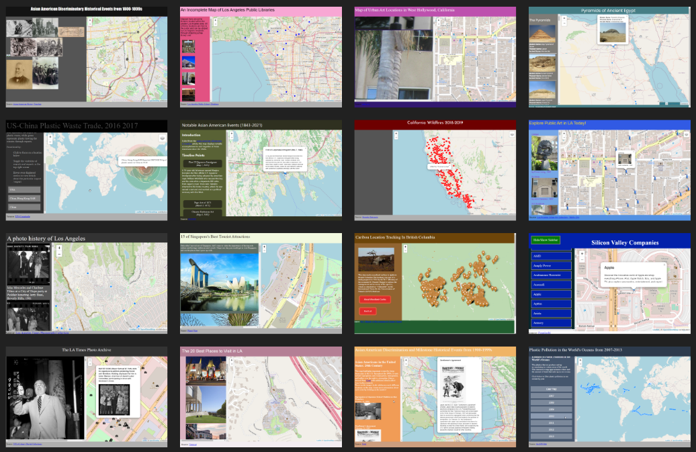

# Week 5

## Today's agenda:

- This session will be recorded
- Concerns/questions/comments, all welcome!
- Let's meet! My office hours are Thursdays from 1-3, or by email appointment ([schedule here](https://calendly.com/yohda/officehours))

### Your CSV maps

- [Map links](https://github.com/yohman/21S-DH151/discussions/37)

#### Maproom honorable mentions

[Link to clickable gallery](https://docs.google.com/presentation/d/1x9cQLKLdXvPjej3T05EjRB8Fl7PnNC4qMHFybx85w1s/edit?usp=sharing)

### Your storyboards

- https://github.com/yohman/21S-DH151/discussions/33

### Week 5 Lab

- [Covid map development](Lab)

# Assignments

## Midterms

