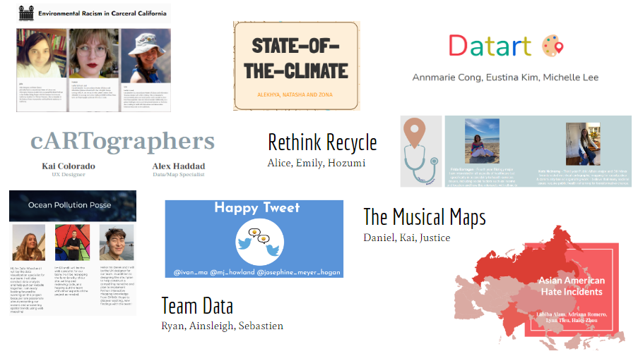

# Week 6 Midterms

## Today's agenda:

- This session will be recorded
- Concerns/questions/comments, all welcome!
- Let's meet! My office hours are Thursdays from 1-3, or by email appointment ([schedule here](https://calendly.com/yohda/officehours))

### Midterm Presentations

Order to be determined during class:

Group | Members
--|--
Rethink Recycle | Alice, Emily, Hozumi
Happy Tweet | Ivan, MJ, Josephine
Datart | Annmarie, Eustina, Michelle
The Musical Maps | Daniel, Kai, Justis
Environmental Racism in Carceral California | Lisa, Hannah, Julia
Ocean Pollution Posse | Julia, Eli, Derek
State-of-the-climate | Alekhya, Natasha, Zona
cARTographers | Kai, Alex
Health Mappers | Frida, Kate
Team Data | Ryan, Ainsleigh, Sebastien
Fantastic Four | Labiba, Haiqi, Adriana, Lynn

## Assignments

### Individual assignment: Provide feedback to two midterm projects

Go to the discussion section and navigate to the [midterm assignments](https://github.com/yohman/21S-DH151/discussions/47). Provide feedback to **two other midterm projects**, making sure to include the following:

- What you liked about the project. Be specific!
- What you recommend the project can work on/improve on for the final (features, additional layers, design/interactive components, improved layout, narrative flow, etc)

Do not provide feedback to a project that already has more than six comments!

### Thinking cap

Topic: Thick mapping in the digital humanities

[Read pages 6-21](https://github.com/yohman/21S-DH151/raw/main/Readings/HyperCities_2014_FINAL.pdf)

Submit a "thinking cap" reaction to the reading. Specifically, discuss the following:

- What are your thoughts on "thick mapping in the digital humanities," and how does it differ from "mapping?"
- How does the theory of "thick mapping" inform narratives that are influencing your life?

Submit your thinking cap assignment [here](https://github.com/yohman/21S-DH151/discussions/51).