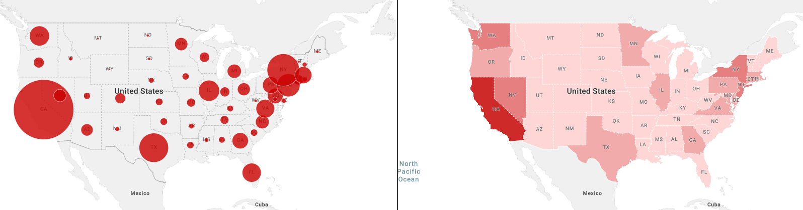
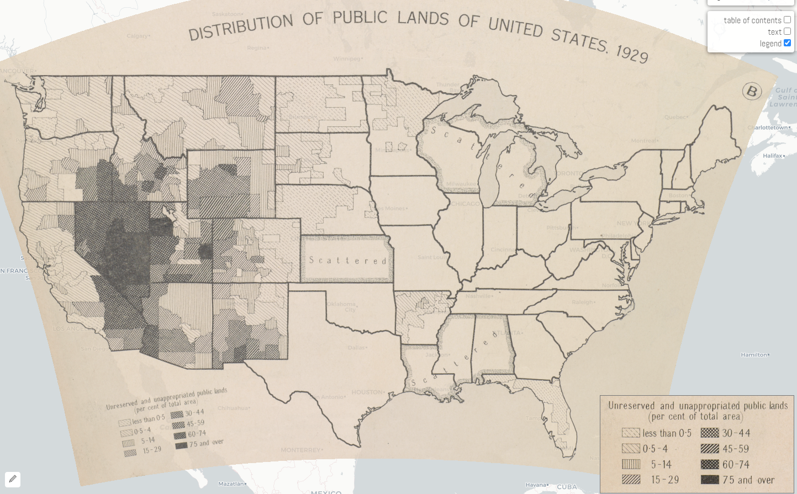
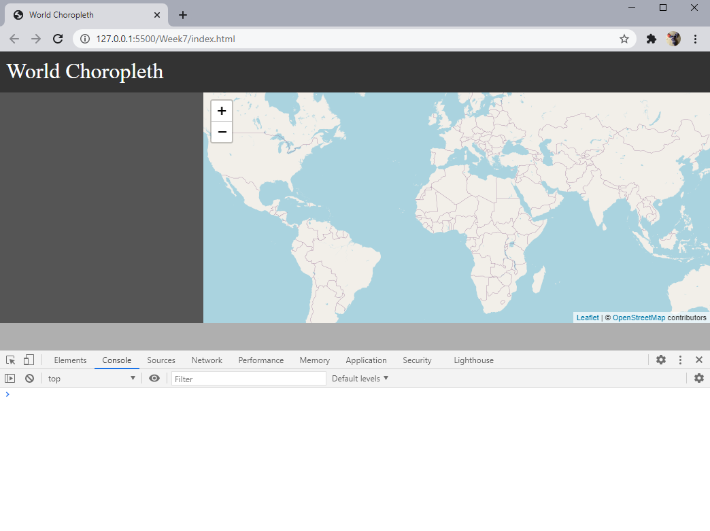
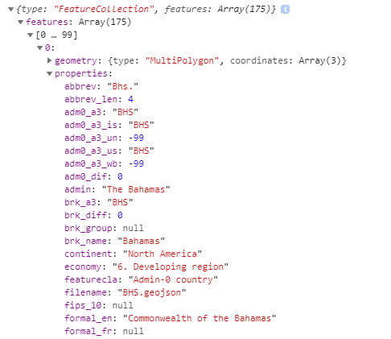
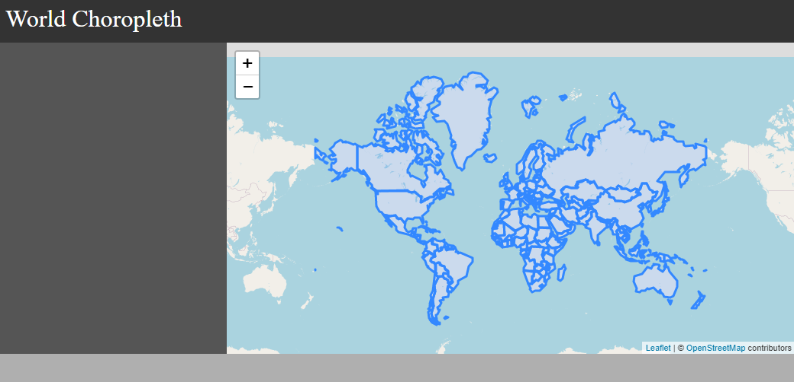
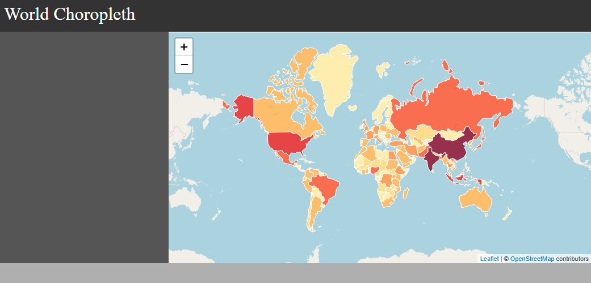
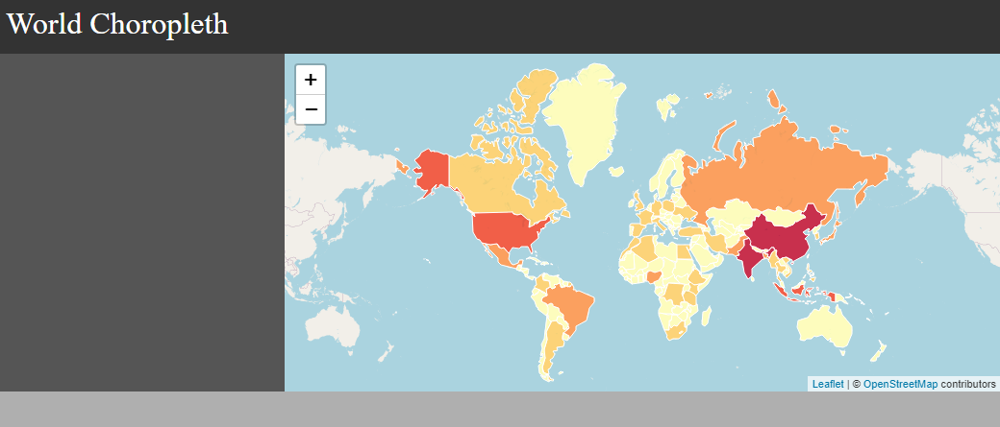
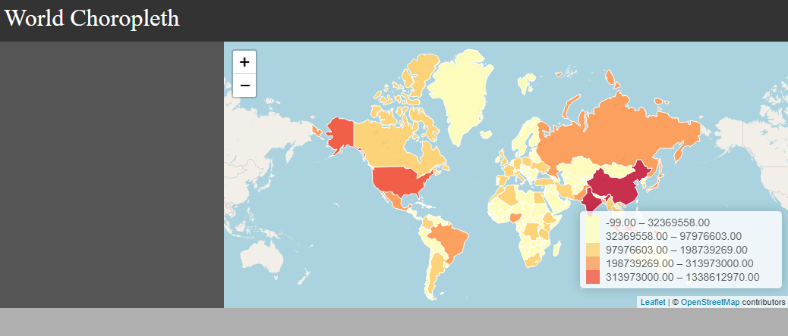
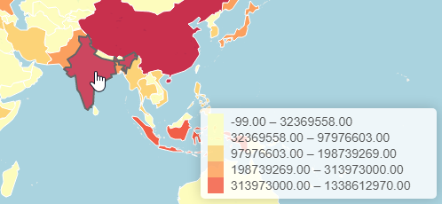

# Week 7 Lab: Choropleth Maps

Welcome to week 7! This week, we will learn how to create choropleth maps. Choropleth maps are a popular method to display statistical data through various shades of patterns or colors on a map.

<a href="https://www.socialexplorer.com/7ed34994e8/view" target="_blank"></a>

## The history of choropleth maps


Source

- https://arcg.is/15Xffe

## Getting started

### Starter files

- starter files available [here](starter)

Or, you can create the files as indicated here:

### `Week4/index.html`

```html
<!DOCTYPE html>
<html>
<head>
	<title>World Choropleth</title>
	<meta charset="utf-8" />

	<!-- style sheets -->
	<link rel="stylesheet" href="css/style.css">

	<!-- leaflet -->
	<link rel="stylesheet" href="https://unpkg.com/leaflet@1.7.1/dist/leaflet.css" />
	<script src="https://unpkg.com/leaflet@1.7.1/dist/leaflet.js"></script>

	<!-- jquery -->
	<script src="https://code.jquery.com/jquery-3.6.0.min.js" integrity="sha256-/xUj+3OJU5yExlq6GSYGSHk7tPXikynS7ogEvDej/m4=" crossorigin="anonymous"></script>

</head>
<body>

	<div class="header">
		World Choropleth
	</div>
	<div class="sidebar">
		
	</div>
	<div class="content">
		<div id="map"></div>
	</div>
	<div class="footer">
	</div>

	<script src="js/map.js"></script>

</body>
</html>
```

### `Week4/js/map.js`

```js
// Global variables
let map;
let lat = 0;
let lon = 0;
let zl = 3;
let path = '';

// initialize
$( document ).ready(function() {
    createMap(lat,lon,zl);
});

// create the map
function createMap(lat,lon,zl){
	map = L.map('map').setView([lat,lon], zl);

	L.tileLayer('https://{s}.tile.openstreetmap.org/{z}/{x}/{y}.png', {
		attribution: '&copy; <a href="https://www.openstreetmap.org/copyright">OpenStreetMap</a> contributors'
	}).addTo(map);
}

```

### `Week4/css/style.css`

```css
body,html {
	margin:0;
	height:100%;
	width:100%;
}

#map {
	height: 100%;
}

body {
	display: grid;
	grid-template-rows: 60px 1fr 40px;
	grid-template-columns: 300px 1fr;
	grid-template-areas: 
	"header header"
	"sidebar content"
	"footer footer";
}

.header {
	grid-area: header;
	padding:10px;
	background-color: #333;
	color: white;
	font-size: 2em;
}

.sidebar {
	color: white;
	grid-area: sidebar;
	padding:10px;
	background-color: #555;
	overflow: auto;
}

.content {
	grid-area: content;
}

.footer {
	grid-area: footer;
	padding:10px;
	background-color: rgb(175, 175, 175);
}
```
Turn on Go Live from your Live Server extension (bottom right of VSCode) and make sure your map works and looks like this:

<kbd></kbd>

## Mapping GeoJSON data

Choropleth maps are based on polygon layers. To create choropleth maps with leaflet, `geojson` is the most popular file type. Note that `topojson` is another format that is favored by many because of its smaller footprint.

- Global source: https://geojson-maps.ash.ms/
- Local source: https://boundaries.latimes.com/sets/
- For US Census Data, [Census Reporter](https://censusreporter.org/) allows you to search for any census variable and download as a `geojson` file.

### Download global geojson data

For this lab, go to https://geojson-maps.ash.ms/ and download all regions of the world in low resolution, and save it in `Week7/data/world.json`.

Once downloaded, add the following global variables:

```js
// put this in your global variables
let geojsonPath = 'data/world.json';
let geojson_data;
let geojson_layer;
```

Create the function `getGeoJSON()` that will read the geojson file into the project. Notice that we are adding the `mapGeoJSON()` function call here, for a function that we will create in the next step.

```js
// function to get the geojson data
function getGeoJSON(){

	$.getJSON(geojsonPath,function(data){
		console.log(data)

		// put the data in a global variable
		geojson_data = data;

		// call the map function
		mapGeoJSON()
	})
}
```
Next, make sure to call the `getGeoJSON()` function in your initialize functions:

```js
// initialize
$( document ).ready(function() {
	createMap(lat,lon,zl);
	getGeoJSON();
});
```
Take a moment to inspect the console output of the geojson data. What do you see? What fields are useful, and which may you want to use to generate a choropleth map with?



### Mapping polygons

Now that we have our geojson data in our javascript, we can proceed to map it. Leaflet comes with a handy `L.geoJson()` function which allows us to easily map it as a layer that sits on top of our basemap.

- https://leafletjs.com/reference-1.7.1.html#geojson

Add the `mapGeoJSON()` function:

```js
// function to map a geojson file
function mapGeoJSON(){

	// create the layer and add to map
	geojson_layer = L.geoJson(geojson_data).addTo(map);

	// fit to bounds
	map.fitBounds(geojson_layer.getBounds())
}
```


## Creating a choropleth map

So far, so good, but we want to color the maps with shades that have statistical values, and tell a story.

Modify `L.geoJson` by adding an argument to style each feature by calling the `getStyle()` function. The `getStyle()` function styles the features, and also calls a `getColor()` function to determine what fill color to use based on the value provided.

```js
function mapGeoJSON(){

	// create the layer and add to map
	geojson_layer = L.geoJson(geojson_data, {
		style: getStyle //call a function to style each feature
	}).addTo(map);

	// fit to bounds
	map.fitBounds(geojson_layer.getBounds())
}

// style each feature
function getStyle(feature){
	return {
		stroke: true,
		color: 'white',
		weight: 1,
		fill: true,
		fillColor: getColor(feature.properties['pop_est']),
		fillOpacity: 0.8
	}
}

// return the color for each feature
function getColor(d) {

	return d > 1000000000 ? '#800026' :
		   d > 500000000  ? '#BD0026' :
		   d > 200000000  ? '#E31A1C' :
		   d > 100000000  ? '#FC4E2A' :
		   d > 50000000   ? '#FD8D3C' :
		   d > 20000000   ? '#FEB24C' :
		   d > 10000000   ? '#FED976' :
					  '#FFEDA0';
}
```



## Classybrew to the rescue

Consider all the work to create the previous chorpleth map. There are a lot of "hard coded" values, especially in determining the break points for the data.

Fortunately, the open source community has come to the rescue, and provided an extension that allows us to easily create breakpoints based on statistical standards for choropleth mapping.

Check out [ClassyBrew](http://tannerjt.github.io/geotanner/javascript/color-theory/2014/10/29/classybrew-jenks-heart-colorbrewer.html) on GitHub.

### Download classbrew and add it to your project

Go to the following link from the classybrew github page, and save the file `classbrew.js`  in your `data/js` folder from their GitHub page:

https://raw.githubusercontent.com/tannerjt/classybrew/master/src/classybrew.js

Add it to your `index.html` file:

```html
	<!-- classy brew -->
	<script src="js/classybrew.js"></script>
```

Now you are ready to brew! We modify the `mapGeoJSON()` function by:

- creating a `brew` object
- adding an argument for `field` to be used as the choropleth variable
- clearing layers that already exist, allowing the function to be called repeatedly
- adding the "brew" arguments

Create the brew object in your global variables:

```js
let brew = new classyBrew();
```

Modify the call the `mapGeoJSON()` by adding the field to be used:

```js
// function to get the geojson data
function getGeoJSON(){

	$.getJSON(geojsonPath,function(data){
		console.log(data)

		// put the data in a global variable
		geojson_data = data;

		// call the map function
		mapGeoJSON('pop_est') // add a field to be used
	})
}
```

Add new features to `mapGeoJSON` and `getStyle`:

```js
function mapGeoJSON(field){

	// clear layers in case it has been mapped already
	if (geojson_layer){
		geojson_layer.clearLayers()
	}
	
	// globalize the field to map
	fieldtomap = field;

	// create an empty array
	let values = [];

	// based on the provided field, enter each value into the array
	geojson_data.features.forEach(function(item,index){
		values.push(item.properties[field])
	})

	// set up the "brew" options
	brew.setSeries(values);
	brew.setNumClasses(5);
	brew.setColorCode('YlOrRd');
	brew.classify('quantiles');

	// create the layer and add to map
	geojson_layer = L.geoJson(geojson_data, {
		style: getStyle //call a function to style each feature
	}).addTo(map);

	map.fitBounds(geojson_layer.getBounds())
}

function getStyle(feature){
	return {
		stroke: true,
		color: 'white',
		weight: 1,
		fill: true,
		fillColor: brew.getColorInRange(feature.properties[fieldtomap]),
		fillOpacity: 0.8
	}
}
```


### Brew options

Classification methods:

```js
brew.getClassificationMethods(); //returns
/*
["equal_interval", "quantile", "jenks"]
*/
```

Colors:

```js
var brew = new classyBrew();
brew.getColorCodes();  // returns
/*
["OrRd", "PuBu", "BuPu", "Oranges", 
"BuGn", "YlOrBr", "YlGn", "Reds", 
"RdPu", "Greens", "YlGnBu", "Purples", 
"GnBu", "Greys", "YlOrRd", "PuRd", "Blues", 
"PuBuGn", "Spectral", "RdYlGn", "RdBu", 
"PiYG", "PRGn", "RdYlBu", "BrBG", 
"RdGy", "PuOr", "Set2", "Accent", 
"Set1", "Set3", "Dark2", "Paired", 
"Pastel2", "Pastel1"];
*/
```

## Adding a legend



Leaflet comes with "controls" that allows you to create panels of information. We can use a control to add a legend.

- https://leafletjs.com/reference-1.7.1.html#control

First, the css to add to `style.css`:

```css
/* legend styles */
.info {
	padding: 6px 8px;
	font: 14px/16px Arial, Helvetica, sans-serif;
	background: white;
	background: rgba(255,255,255,0.8);
	box-shadow: 0 0 15px rgba(0,0,0,0.2);
	border-radius: 5px;
	min-width: 250px;
	min-height: 50px;
}
.info h4 {
	margin: 0 0 5px;
	color: #777;
}

.legend {
	line-height: 18px;
	color: #555;
}
.legend i {
	width: 18px;
	height: 18px;
	float: left;
	margin-right: 8px;
	opacity: 0.7;
}
```

Add a global variable for the legend object:

```js
let legend = L.control({position: 'bottomright'});
```

The javascript:

```js
function createLegend(){
	legend.onAdd = function (map) {
		var div = L.DomUtil.create('div', 'info legend'),
		breaks = brew.getBreaks(),
		labels = [],
		from, to;
		
		for (var i = 0; i < breaks.length; i++) {
			from = breaks[i];
			to = breaks[i + 1];
			if(to) {
				labels.push(
					'<i style="background:' + brew.getColorInRange(from) + '"></i> ' +
					from.toFixed(2) + ' &ndash; ' + to.toFixed(2));
				}
			}
			
			div.innerHTML = labels.join('<br>');
			return div;
		};
		
		legend.addTo(map);
}
```

Finally, make sure to add a call to create the legend at the end of your `mapGeoJSON()` function:

```js
function mapGeoJSON(field){

	...

	// create the legend
	createLegend();
}
```

## Adding hover actions



First, set the stage to enable hover actions on each feature in your geojson layer.

Locate the code within the `mapGeoJSON()` function that creates the `geojson_layer`, and add the `onEachFeature` argument as shown below:

```js
	// create the geojson layer
	geojson_layer = L.geoJson(geojson_data,{
		style: getStyle,
		onEachFeature: onEachFeature // actions on each feature
	}).addTo(map);

```

Next, you create the `onEachFeature` function that will enable `mouseover`, `mouseout` and `click` events. You will then create a function for each one of these events.

```js
// Function that defines what will happen on user interactions with each feature
function onEachFeature(feature, layer) {
	layer.on({
		mouseover: highlightFeature,
		mouseout: resetHighlight,
		click: zoomToFeature
	});
}

// on mouse over, highlight the feature
function highlightFeature(e) {
	var layer = e.target;

	// style to use on mouse over
	layer.setStyle({
		weight: 2,
		color: '#666',
		fillOpacity: 0.7
	});

	if (!L.Browser.ie && !L.Browser.opera && !L.Browser.edge) {
		layer.bringToFront();
	}
}

// on mouse out, reset the style, otherwise, it will remain highlighted
function resetHighlight(e) {
	geojson_layer.resetStyle(e.target);
}

// on mouse click on a feature, zoom in to it
function zoomToFeature(e) {
	map.fitBounds(e.target.getBounds());
}
```

You see the pattern here? You are in control of user interaction! Each one of these action functions can be modified to fit your user interface design ideas.

## To pop-up or not to pop-up

Thus far, many of us have been using marker popups as a way to reveal information about features on the map. Perhaps a more informative, cleaner, and elegant approach is to use an info panel to display data about features you are hovering over.

### Create an "info control"

First create a global variable for the control panel:

```js
let info_panel = L.control();
```

Then, create a function to add the control panel:

```js
function createInfoPanel(){

	info_panel.onAdd = function (map) {
		this._div = L.DomUtil.create('div', 'info'); // create a div with a class "info"
		this.update();
		return this._div;
	};

	// method that we will use to update the control based on feature properties passed
	info_panel.update = function (properties) {
		// if feature is highlighted
		if(properties){
			this._div.innerHTML = `<b>${properties.name}</b><br>${fieldtomap}: ${properties[fieldtomap]}`;
		}
		// if feature is not highlighted
		else
		{
			this._div.innerHTML = 'Hover over a country';
		}
	};

	info_panel.addTo(map);
}
```

Add the call to create the info panel:
```js
function mapGeoJSON(field){

	...

	// create the infopanel
	createLegend();
}
```


Then, in the `highlightFeature(e)` function, which is triggered when a user hovers over a feature, add the following:

```js
function highlightFeature(e){
	...
	info_panel.update(layer.feature.properties)
}

function resetHighlight(e){
	...
	info_panel.update() // resets infopanel
}
```

## Completed code

Find the completed files for this lab [here](completed).

## Challenge #1:

Create buttons in the sidebar that will allow you to map different variables.


## Challenge #2:

Now that we are 'brewing, let's add some additional (useful) arguments to the function. For example, aside from the field to be choropleth'ed, why don't we also request a color pallette, number of classes, and a classfication scheme?

Modify the `mapGeoJSON` function with the added arguments:

```js
function mapGeoJSON(field,num_classes,color,scheme){
	...
}
```
## Useful Resource

If you have your data in a csv file, and want to add it to a world geojson file, this is a great resource to merge a csv file to a geojson file:

- [Geo DataMerger](https://funkeinteraktiv.github.io/geo-data-merger/)