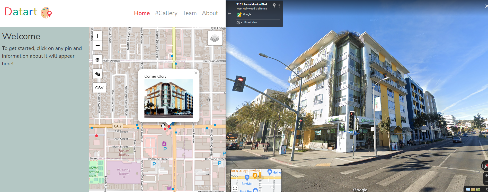
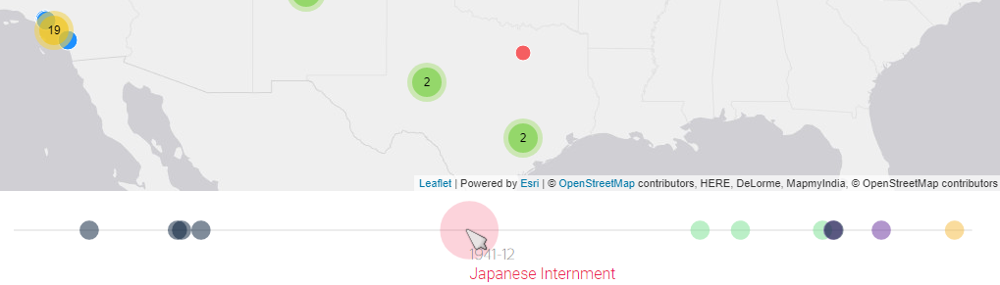
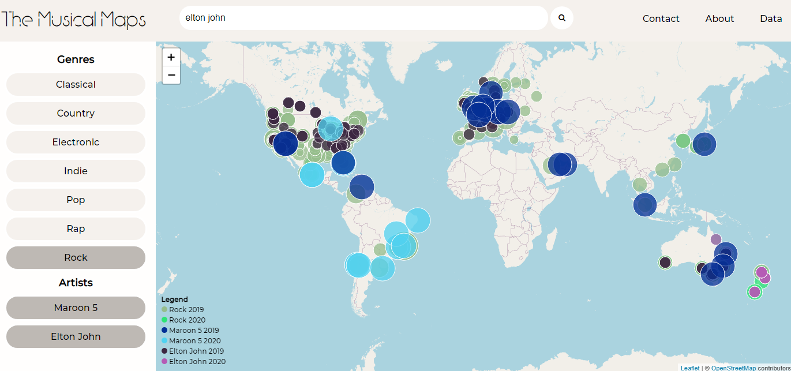

# Week 7

## Today's agenda:

- This session will be recorded
- Concerns/questions/comments, all welcome!
- Let's meet! My office hours are Thursdays from 1-3, or by email appointment ([schedule here](https://calendly.com/yohda/officehours))

## Midterm presentations "out of the box" awards

### Datart's street view
<kbd></kbd>

### Fantastic timeline
<kbd></kbd>

### Musical searches
<kbd></kbd>

## Thick mapping

Notable reactions:

> "Thick mapping is completely different than normal mapping..." - Josephine

> "Considering the role that mapping has played historically in settler-colonialism, thick mapping is almost radical in its practice of bringing different narratives and histories to the forefront." - Alice

> "Thinking about sociology with thick mapping in mind is exciting, as it opens my eyes up to the potential that thick mapping could have for a future sociology project where mapping is used as a research tool." -MJ

> "As a statistics major, the theory of "thick mapping" reminds me to always think about the narrative behind the data that I am analyzing and that data is not just numbers." - Eustina

> "Many applications and platforms I use in my day-to-day life utilize thick mapping to enhance the user's experience." -Michelle

> "I think Thick mapping will allow us to tell any kind of story we are passionate about." -Alekhya

> ""Thick mapping" is a reminder at the back of my head that not everything we receive or learn about is ever "complete"." - Natasha

> "Thick mapping pushes for us to remember that the lives are not separate from the data..." -Hannah

> "Thick mapping also strives to show the stories and lives of people from an area that might have been erased or silenced..." - Julia Wood

> "...thick mapping is like critical thinking because it allows us to see beyond data and information and to look at different narratives ..." - Haiqi

> "...I can understand thick mapping as a sort of “reversed onion..." - Frida

> "...The idea of HyperCities kind of conveys the Big Brother Ideology of a global time/location map that would map out our whole lives, connecting certain points of my life with edges of influence from many different other points in my life and other people's life... - Ivan

> "...the theory of thick mapping speaks to a multitude of power structures and systems that shape how we think and interact with each other, and is a reminder that I have to stay vigilant and critical of pervasive forms of knowledge and tropes of understanding, as there are ceaseless places, media, and interpretations to uncover." - Kate

## Week 7 Lab
- [Creating choropleth maps](lab)

## Assignments

### Group Assignment #3

[Link to assignment](https://github.com/yohman/21S-DH151/blob/main/Group%20Assignments/GroupAssignment3.md)

