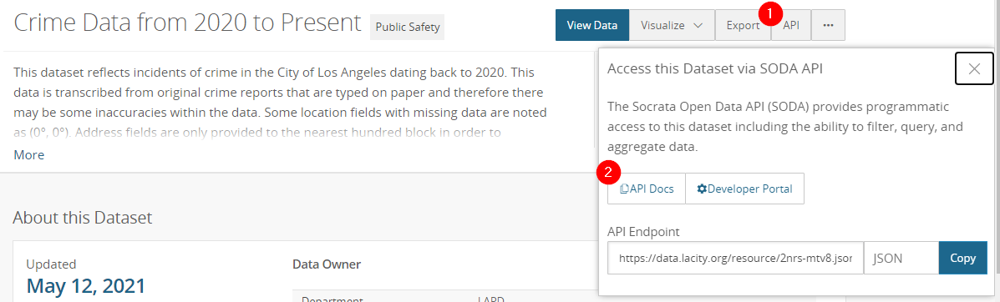
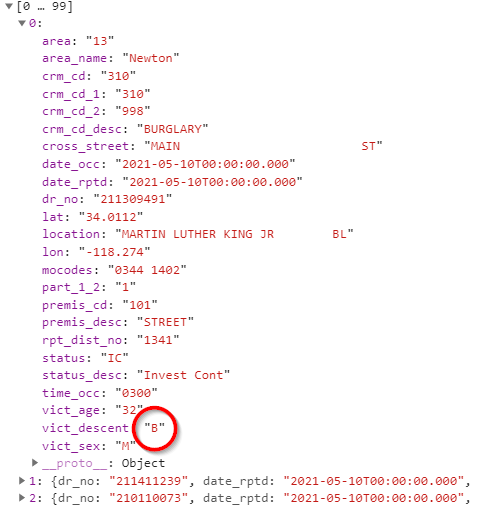
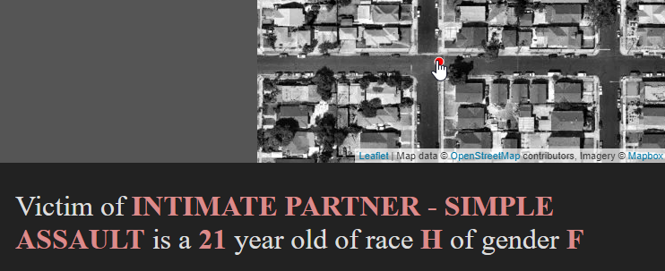
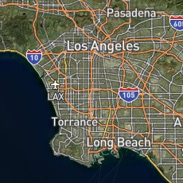
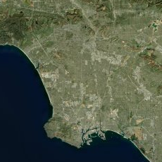
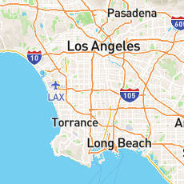
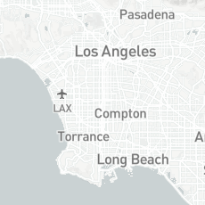
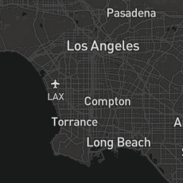
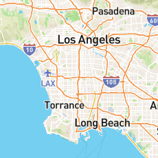
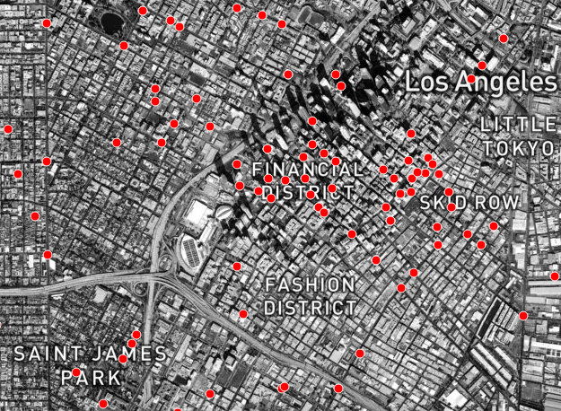

# Week 8: Mapathon Time

Welcome to week 8! This week, we will be doing a mapathon.

You are given the following tasks:

## Create a victim crime map

Who is victimized by crime in LA? Using data directly from the LA Data Portal, create a map that shows the location of the last 1000 crime incidents. Allow users to see details about the crime incident when they interact with the markers on the map.

### Technical scope

#### Crime data

About the data: You can import crime data directly from the API endpoint provided by the LA Data Portal. From [Crime Data from 2020 to Present](https://data.lacity.org/Public-Safety/Crime-Data-from-2020-to-Present/2nrs-mtv8):

<kbd>

The following function grabs the last 1000 rows (note the added `$order` parameter). Documentation on these SoQL clauses can be found [here](https://dev.socrata.com/docs/queries/).

```js
function getJSON(){
	$.getJSON('https://data.lacity.org/resource/2nrs-mtv8.json?$order=date_rptd%20desc',function(data){
		console.log(data)
		jsondata = data;
		mapJSON()
	})
}
```

Inspect the data returned by the console, and create the `mapJSON()` function to map it.


## Creating Filters
Create filters that allow users to show subsets of the crime data. Specifically, allow users to filter by victim ethnicity.

To do so, use the javascript array filter method to filter elements in an array. Here is a great explanation of how this method works:

- https://www.javascripttutorial.net/javascript-array-filter/

As an example, you can use the `.filter` function to subset an existing data array by asking it to return records that match a specific request. The following example shows how to filter the `jsondata` array with only items that have `vict_descent` equal to 'B' (black).

Here is the console output, with the column we want to filter by highlighted:

<kbd></kbd>

To filter the data where `vict_descent` is `B`, the javascript would be:

```js
filtered_data = jsondata.filter(item => item.vict_descent === 'B')
```

Use the logic above to allow users to filter the data by the different main race categories:
- 'B' for Black
- 'W' for White
- 'H' for Hispanic
- 'A' for Asian
- 'O' for Other

Hint: Add an argument for `race` in your `mapJSON(race)` function.

## Humanize the data



Simply plotting crime incidents on the map does not convey the human drama behind each marker. Add an interactive `mouseover` event to the markers/circles that conveys the crime incident to the user in a creative and dramatic manner.

```js
...
.on('mouseover',function(){
	...
});
```

## Changing basemaps

[Mapbox](https://www.mapbox.com/) is an online Web GIS platform that provides beautifully tiled basemaps that can be used with leaflet, provided that you create an account to obtain an access token. The free tier is generous, perfect for student run class projects!

```js
	L.tileLayer('https://api.mapbox.com/styles/v1/mapbox/{id}/tiles/{z}/{x}/{y}?access_token={accessToken}',
	{
		attribution: 'Map data &copy; <a href="https://www.openstreetmap.org/copyright">OpenStreetMap</a> contributors, Imagery © <a href="https://www.mapbox.com/">Mapbox</a>',
		maxZoom: 18,
		id: 'satellite-streets-v11',
		tileSize: 512,
		zoomOffset: -1,
		accessToken: 'your access token'
	}).addTo(map);
```

Note that you have the following options for the id value for different basemap styles:

id | image
--- | ---
satellite-streets-v11 | 
satellite-v9 | 
streets-v11 | 
light-v10 | 
dark-v10 | 
outdoors-v11 | 

### Mapbox Studio



If you want to further customize your basemaps, you can venture into the world of [Mapbox Studio](https://www.mapbox.com/mapbox-studio) and design your own. Here is an example of a black and white satellite basemap, which allows your data to "pop" without color conflicts.
