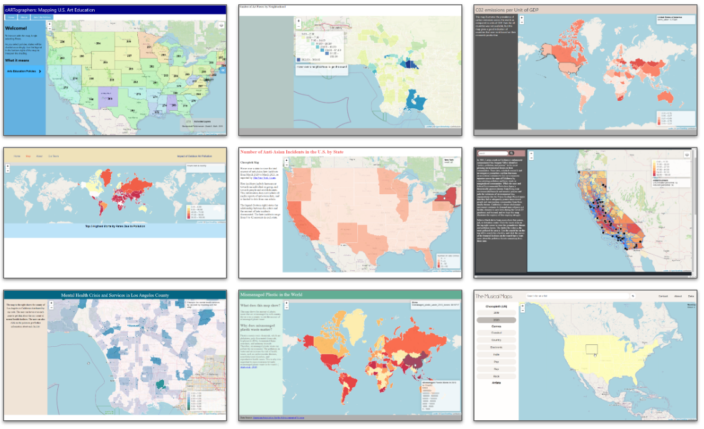

# Week 8

## Today's agenda:

- This session will be recorded
- Concerns/questions/comments, all welcome!
- Let's meet! My office hours are Thursdays from 1-3, or by email appointment ([schedule here](https://calendly.com/yohda/officehours))

## Special guest lecture

"Mapping the connection between technology and ethics"
- Albert Kochaphum
- Campus GIS Coordinator (Office of Advanced Research Computing)
- Faculty in the Asian American Studies
- Currently teaching "Asian Am 191A – Web Development and GIS for Social Change: Critical Data for Transforming Civil Society"

## Choropleth Gallery

### Thinking "out of the box" awards

Project | Link
--- | ---
cARTographers: Mapping U.S. Art Education | [map](https://kaicolorado.github.io/DH151-Group/index.html)
Mental Health Crisis and Services in LA County | [map](https://frida-barragan.github.io/DH151/joindata/index.html)

## Week 8 Lab
- [Mapathon: Creating filters | Mapbox Basemaps](Lab)

## Assignments

### Individual Assignment: Thinking Cap on "Design Justice"

What do you think about design justice? How might you apply it in your designs going forward?

- The reading on [Design Justice](https://github.com/albertkun/21S-ASIAAM-191A/blob/main/Week_6/Materials/Design_Justice.pdf) will be important to completing this thinking cap.

Submit your thinking cap [here](https://github.com/yohman/21S-DH151/discussions/65).

### Group Assignment

There are no graded group deliverables for next week. However, in two weeks (Week 10), you will be asked to submit a pre-final prototype/status report (fourth and final group assignment). As your group gears towards the final deadline, I ask that each group answer a [short set of questions](https://github.com/yohman/21S-DH151/discussions/66).