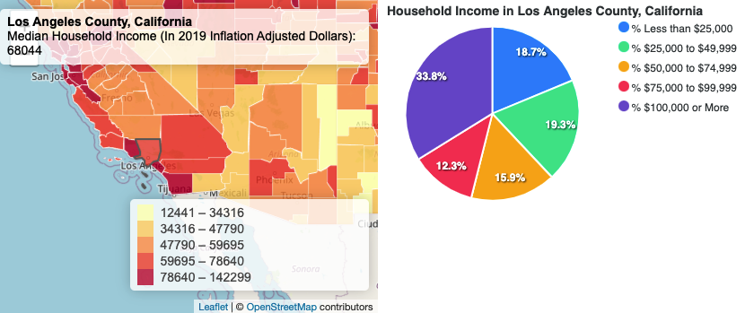

# Week 9

## Code Review

Welcome to week 9! This week, we begin by doing a general code review.

### Your file structure

```
+ web root
+ -- index.html
+ -- css
	 + -- style.css
	 + -- other_libraries.css
+ -- js
	 + map.js
	 + other_libraries.js
+ -- data
	 + world.geojson
	 + indicators.csv
```

### Your HTML


```html
<!DOCTYPE html>
<html>
<head>
	<title>Your Page Title</title>
	<meta charset="utf-8" />

	<!-- your style sheet -->
	<link rel="stylesheet" href="css/style.css">

	<!-- leaflet -->
	<link rel="stylesheet" href="https://unpkg.com/leaflet@1.7.1/dist/leaflet.css" />
	<script src="https://unpkg.com/leaflet@1.7.1/dist/leaflet.js"></script>

	<!-- jquery -->
	<script src="https://code.jquery.com/jquery-3.6.0.min.js" integrity="sha256-/xUj+3OJU5yExlq6GSYGSHk7tPXikynS7ogEvDej/m4=" crossorigin="anonymous"></script>

	<!-- papaparse for csv data -->
	<script src="https://cdnjs.cloudflare.com/ajax/libs/PapaParse/5.3.0/papaparse.min.js"></script>

	<!-- other libraries will go here -->

</head>
<body>

	<div class="header">
		Covid Confirmed Cases by Country
	</div>
	<div class="sidebar"></div>
	<div class="content">
		<div id="map"></div>
	</div>
	<div class="footer"></div>

	<!-- your javascript is at the bottom -->
	<script src="js/map.js"></script>

</body>
</html>
```

#### Local files vs CDN's

In the code above, each library (leaflet, jQuery, and papaparse) use a CDN link. A CDN is a Content Delivery Network, essentially, a group of servers in the "cloud" delivering web services to specific files, such as javascript and stylesheet libraries. This is nice, as you do not have to host the files yourself, but it also makes your project dependent on external factors.

Because this course has focused on open source technologies, each library is typically hosted on GitHub, allowing you to download the latest working version. If you want to "lock down" your code for archival purposes, it is a good idea to host your files locally and have as little external dependencies as possible. Your project can live a long a properous life!

#### Class vs ID

Notice that your html has `divs` with classes. Classes give each div an identifier (like a tag) that allows you to style them in your css. Classes can be used on multiple elements (like `<div>`, `<span>`, `<p>`, etc).

ID's on the other hand, are unique identifiers. Since you will typically only have one map on your web page, it is considered unique, and therefore, rather than using classes, you use an `id`.

### Your CSS


Admittedly, we have spent very little class time on learning css. With just a limitted understanding of css, you are capable of building amazing applications. However, the world of web design is boundless, and any design implications on web development will revolve around a strategic css implementation.

```css
body,html {
	margin:0;
	height:100%;
	width:100%;
}

#map {
	height: 100%;
}

body {
	display: grid;
	grid-template-rows: 60px 1fr 40px;
	grid-template-columns: 300px 1fr;
	grid-template-areas: 
	"header header"
	"sidebar content"
	"footer footer";
}

.header {
	grid-area: header;
	padding:10px;
	background-color: #333;
	color: white;
	font-size: 2em;
}

.sidebar {
	color: white;
	grid-area: sidebar;
	padding:10px;
	background-color: #555;
	overflow: auto;
}

.content {
	grid-area: content;
}

.footer {
	grid-area: footer;
	padding:10px;
	background-color: rgb(175, 175, 175);
}
```
While there are many different approaches and platforms to style your website, the "grid-template" is a relatively new and modern concept, first launched in 2017. It has allowed the quick development of "grid" layouts with ease. Believe me, prior to grids, css'ing layouts with rows and columns were notoriously challenging (and mind-numbingly frustrating!).

For a good overview of grid-templates:

- https://developer.mozilla.org/en-US/docs/Web/CSS/grid-template

### Your javascript


The javascript, as you have no doubt learned, is the heart and soul of your web project. It prepares your data, creates the interactive maps, and considers all types of user interaction. And it is entirely up to YOU as to how you will build it.

In general, our javascript is broken down into several components.

#### Global variables

It begins with global variables. These variables are available "globally" anywhere in your code. It can be accessed inside and outside of a function, and you can access it in the browser's console as well.

For our applications, we may decide to create an "empty" variable (a placeholder) in the global space, and later assign its content *inside* a function. A good example of this is when you have a function that gets data from a local or external file/API. You then want to assign the data to a global variable so that you can access the data anywhere else in your application.

#### Functions

Functions are dormant unless called upon. They are pockets of functional code that do as they are programmed to do at a moments notice. "Get data," "create a map," "create a legend," "convert something from one form to another," "zoom to something," are all examples of functions we have used in our class.

#### Events and actions

Remember that javascript is what takes a website beyond a "static" html page. In other words, it allows you to create dynamically updating content. This can be done in a myriad of ways, but for now, we have focused on user interactions that involve `onclick` and `onmouseover` events.

#### Workflow

1. create global variables
   ```js
   let lat = 39;
   let lon = -100;
   let zl = 5;
   ```
1. initialize the application
   ```js
   // initialize
	$( document ).ready(function() {
		createMap(lat,lon,zl);
	});
	```
1. get the data
1. map the data
1. create legends
1. create sidebar content
1. create events and actions

#### 

# Creating a dashboard


For this lab, we will look to create data visualizations based on ACS data. The data was downloaded from Social Explorer, cleaned up extensively in Excel, and merged with a US County geojson layer. This data preparation step in itself took a few hours!

## Starter files


### `index.html`
```html
<!DOCTYPE html>
<html>
<head>
	<title>US in Poverty</title>
	<meta charset="utf-8" />

	<!-- style sheets -->
	<link rel="stylesheet" href="css/style.css">

	<!-- leaflet -->
	<link rel="stylesheet" href="https://unpkg.com/leaflet@1.7.1/dist/leaflet.css" />
	<script src="https://unpkg.com/leaflet@1.7.1/dist/leaflet.js"></script>

	<!-- jquery -->
	<script src="https://code.jquery.com/jquery-3.6.0.min.js" integrity="sha256-/xUj+3OJU5yExlq6GSYGSHk7tPXikynS7ogEvDej/m4=" crossorigin="anonymous"></script>

	<!-- classy brew -->
	<script src="js/classybrew.js"></script>

</head>
<body>

	<div class="header">
		The US in Poverty
	</div>

	<div class="sidebar"></div>
	
	<div class="content">
		<div id="map"></div>
	</div>
	
	<div class="footer"></div>

	<script src="js/map.js"></script>

</body>
</html>
```
### `css/style.css`
```css
body,html {
	margin:0;
	height:100%;
	width:100%;
}

#map {
	height: 100%;
}

body {
	display: grid;
	grid-template-rows: 60px 1fr 50px;
	grid-template-columns: 300px 1fr;
	grid-template-areas: 
	"header header"
	"sidebar content"
	"footer footer";
}

.header {
	grid-area: header;
	padding:10px;
	background-color: #333;
	color: white;
	font-size: 2em;
}

.sidebar {
	color: white;
	grid-area: sidebar;
	padding:10px;
	background-color: #555;
	overflow: auto;
}

.content {
	grid-area: content;
}

.footer {
	grid-area: footer;
	background-color: gray;
}

/* legend styles */
.info {
	padding: 6px 8px;
	font: 14px/16px Arial, Helvetica, sans-serif;
	background: white;
	background: rgba(255,255,255,0.8);
	box-shadow: 0 0 15px rgba(0,0,0,0.2);
	border-radius: 5px;
	min-width: 250px;
	min-height: 50px;
}

.legend {
	line-height: 18px;
	color: #555;
}
.legend i {
	width: 18px;
	height: 18px;
	float: left;
	margin-right: 8px;
	opacity: 0.7;
}
```

### `js/map.js`
```js
// Global variables
let map;
let lat = 39;
let lon = -98;
let zl = 4;

let geojsonPath = 'data/merged.geojson';
let geojson_data;
let geojson_layer;

let brew = new classyBrew();
let legend = L.control({position: 'bottomright'});
let info_panel = L.control();

let fieldtomap = 'Median Household Income (In 2019 Inflation Adjusted Dollars)';

// initialize
$( document ).ready(function() {
	createMap(lat,lon,zl);
	getGeoJSON();
});

// create the map
function createMap(lat,lon,zl){
	map = L.map('map').setView([lat,lon], zl);

	L.tileLayer('https://{s}.tile.openstreetmap.org/{z}/{x}/{y}.png', {
		attribution: '&copy; <a href="https://www.openstreetmap.org/copyright">OpenStreetMap</a> contributors'
	}).addTo(map);
}

// function to get the geojson data
function getGeoJSON(){

	$.getJSON(geojsonPath,function(data){
		console.log(data)

		// put the data in a global variable
		geojson_data = data;

		// call the map function
		mapGeoJSON(fieldtomap,5,'YlOrRd','quantiles');
	})
}

function mapGeoJSON(field,num_classes,color,scheme){

	// clear layers in case it has been mapped already
	if (geojson_layer){
		geojson_layer.clearLayers()
	}
	
	// globalize the field to map
	fieldtomap = field;

	// create an empty array
	let values = [];

	// based on the provided field, enter each value into the array
	geojson_data.features.forEach(function(item,index){
		if((item.properties[field] != undefined ) ){
			values.push(item.properties[field])
		}
	})

	// set up the "brew" options
	brew.setSeries(values);
	brew.setNumClasses(num_classes);
	brew.setColorCode(color);
	brew.classify(scheme);

	// create the layer and add to map
	geojson_layer = L.geoJson(geojson_data, {
		style: getStyle, //call a function to style each feature
		onEachFeature: onEachFeature // actions on each feature
	}).addTo(map);

	// turning off fit bounds so that we stay in mainland USA
	// map.fitBounds(geojson_layer.getBounds())

	// create the legend
	createLegend();

	// create the infopanel
	createInfoPanel();
}

function getStyle(feature){
	return {
		stroke: true,
		color: 'white',
		weight: 1,
		fill: true,
		fillColor: brew.getColorInRange(feature.properties[fieldtomap]),
		fillOpacity: 0.8
	}
}

function createLegend(){
	legend.onAdd = function (map) {
		var div = L.DomUtil.create('div', 'info legend'),
		breaks = brew.getBreaks(),
		labels = [],
		from, to;
		
		for (var i = 0; i < breaks.length; i++) {
			from = breaks[i];
			to = breaks[i + 1];
			if(to) {
				labels.push(
					'<i style="background:' + brew.getColorInRange(to) + '"></i> ' +
					from.toFixed(0) + ' &ndash; ' + to.toFixed(0));
				}
			}
			
			div.innerHTML = labels.join('<br>');
			return div;
		};
		
		legend.addTo(map);
}

function createInfoPanel(){

	info_panel.onAdd = function (map) {
		this._div = L.DomUtil.create('div', 'info'); // create a div with a class "info"
		this.update();
		return this._div;
	};

	// method that we will use to update the control based on feature properties passed
	info_panel.update = function (properties) {
		// if feature is highlighted
		if(properties){
			this._div.innerHTML = `<b>${properties['Qualifying Name']}</b><br>${fieldtomap}: ${properties[fieldtomap]}`;
		}
		// if feature is not highlighted
		else
		{
			this._div.innerHTML = 'Hover over a country';
		}
	};

	info_panel.addTo(map);
}

// Function that defines what will happen on user interactions with each feature
function onEachFeature(feature, layer) {
	layer.on({
		mouseover: highlightFeature,
		mouseout: resetHighlight,
		click: zoomToFeature
	});
}

// on mouse over, highlight the feature
function highlightFeature(e) {
	var layer = e.target;

	// style to use on mouse over
	layer.setStyle({
		weight: 2,
		color: '#666',
		fillOpacity: 0.7
	});

	if (!L.Browser.ie && !L.Browser.opera && !L.Browser.edge) {
		layer.bringToFront();
	}

	info_panel.update(layer.feature.properties);

}

// on mouse out, reset the style, otherwise, it will remain highlighted
function resetHighlight(e) {
	geojson_layer.resetStyle(e.target);
	info_panel.update() // resets infopanel
}

// on mouse click on a feature, zoom in to it
function zoomToFeature(e) {
	map.fitBounds(e.target.getBounds());
}
```
### `js/classybrew.js`
Classybrew (which allows us to create the choropleth breaks) does not have a CDN. Save and download it into your js folder.

- https://raw.githubusercontent.com/tannerjt/classybrew/master/src/classybrew.js

### `data/merged.geojson`

And finally, download the data file and put it in your data folder:

- https://github.com/yohman/21S-DH151/blob/staging/Weeks/Week09/Lab/completed/data/merged.geojson


The starter files (also available [here](starter)) should produce a US County choropleth map. Open the console, and inspect the data fields that are available.

## Charts

### Create a new dashboard panel

Add a new `div` with class `dashboard`, right above the footer div in the `index.html` file.

```html
<body>
	...
	<div class="dashboard"></div>
	<div class="footer"></div>
	...
</body>
```

Now that the container for the dashboard has been created, we need to give it some css.

```css
body {
	display: grid;
	grid-template-rows: 60px 1fr 1fr;
	grid-template-columns: 1fr 1fr;
	grid-template-areas: 
	"header header"
	"content dashboard"
	"footer footer";
}

.dashboard {
	grid-area: dashboard;
}
```
Nice! You should now have a new panel to the right of your map. This is where we will add a dashboard full of data as users interact with the map.

Since our new layout does not use a sidebar, we can safely delete the sidebar div:

```html
	<!-- delete me -->
	<div class="sidebar"></div>
```

So how will the dashboard function? The UI dictates that as a user hovers over the map features, the dashboard will automatically create a report based on the feature highlighted. Our javascript already has a function that handles mouseover actions, so let's create a function call within it. At the bottom of the `highlightFeature()` function, add the call to `createDashboard()`, feeding it the properties of the highlighted feature.

```js
// on mouse over, highlight the feature
function highlightFeature(e) {
	...
	createDashboard(layer.feature.properties)
}
```

Next, we author the function itself. For now, create an empty function that dumps the data that is being fed into it into the console.

```js
function createDashboard(properties){
	console.log(properties)
}
```
Inspect the values in the console. This is what we have to work with to create our charts.

## Charts

There are many javascript charting libraries to use. Here are some of the free and open source projects:

- https://apexcharts.com/
- https://www.chartjs.org/
- https://gionkunz.github.io/chartist-js/index.html
- https://developers.google.com/chart (not open source but free)

Each library produces similar types of charts, but the code to produce the charts are slightly different. It is important to go over the documentation to see which library would work best with the data that you have.

For this lab, we will use Apex Charts. Add the library to your `index.html` file:

```html
	<!-- apex charts -->
	<script src="https://cdn.jsdelivr.net/npm/apexcharts"></script>
```

Now that we have checked out what Apex Charts can do, let's put it into action. Modify the `createDashboard()` function by adding code to create a sample chart:

```js
function createDashboard(properties){

	// clear dashboard
	$('.dashboard').empty();

	console.log(properties)

	// chart title
	let title = 'Championships Won';

	// data values
	let data = [27,17,17,20];

	// data fields
	let fields = ['New York Yankees','LA Lakers','Boston Celtics','Manchester United'];

	// set chart options
	let options = {
		chart: {
			type: 'bar',
			height: 300,
			animations: {
				enabled: true,
			}
		},
		title: {
			text: title,
		},
		plotOptions: {
			bar: {
				horizontal: true
			}
		},
		series: [
			{
				data: data
			}
		],
		xaxis: {
			categories: fields
		}
	}
	
	// create the chart
	let chart = new ApexCharts(document.querySelector('.dashboard'), options)
	chart.render()
}
```


For a pie chart, replace the options with the following:

```js
	let options = {
		chart: {
			type: 'pie',
			height: 400,
			width: 400,			
			animations: {
				enabled: true,
			}
		},
		title: {
			text: title,
		},
		series: data,
		labels: fields,
		legend: {
			position: 'right',
			offsetY: 0,
			height: 230,
		  }
	};
```
<kbd></kbd>

As you can see, each chart type has a different set of options that are slightly different in their configuration.

Now we need to replace these numbers with data that is driven by the user action.

Recall that the function already receives data, and that we are outputting the data into the console. Look at the variables that are related to Household Income:

<kbd></kbd>

What would we have to do to create a pie chart with these variables? Modify the code in the `createDashboard()` function to generate the following pie charts:

<kbd></kbd>


## Tables

- https://gridjs.io/docs/examples/import-json
- http://js-grid.com/getting-started/

Adding tables allows you to visualize your data in tabular format. This may be useful when you want to display rankings of particular attributes in your data. Linking the table rows with the elements on the map is what makes spatial exploration powerful, essentially mapping the **what** with the **where**.

### Import the js and css files

For this lab, we will use js-grid. Add the javascript and css to your `index.html` file:

```html
	<!-- js-grid -->
	<link type="text/css" rel="stylesheet" href="https://cdnjs.cloudflare.com/ajax/libs/jsgrid/1.5.3/jsgrid.min.css" />
	<link type="text/css" rel="stylesheet" href="https://cdnjs.cloudflare.com/ajax/libs/jsgrid/1.5.3/jsgrid-theme.min.css" />
	<script type="text/javascript" src="https://cdnjs.cloudflare.com/ajax/libs/jsgrid/1.5.3/jsgrid.min.js"></script>
```

### Create a function that generates the table

Create a new function that will create a table in the footer area. Since we want to display our GeoJSON data in table form, let us first determine how the data needs to be formatted.

According to the documentation, the data must be in an array of objects. Here is a sample output from their documentation:

```js
    var clients = [
        { "Name": "Otto Clay", "Age": 25, "Country": 1, "Address": "Ap #897-1459 Quam Avenue", "Married": false },
        { "Name": "Connor Johnston", "Age": 45, "Country": 2, "Address": "Ap #370-4647 Dis Av.", "Married": true },
        { "Name": "Lacey Hess", "Age": 29, "Country": 3, "Address": "Ap #365-8835 Integer St.", "Married": false },
        { "Name": "Timothy Henson", "Age": 56, "Country": 1, "Address": "911-5143 Luctus Ave", "Married": true },
        { "Name": "Ramona Benton", "Age": 32, "Country": 3, "Address": "Ap #614-689 Vehicula Street", "Married": false }
    ];
```

In order to get our data to work, we have to put maniputlate our data so that it adhere's to the data format requirement for the table otuput. So what does our GeoJSON data look like? Recall that we put the data in a global variable `geojson_data`. Output the data in the browser console to inspect it.

<kbd></kbd>

The output suggests that we need to do some work before we can get it into the format that the table can read, that is, into an array of objects. The current output is an object `geojson_data` with an array `features` which has multiple objects in it, once of which is `properties`, which contains the data we need. I know, it's confusing! But once we figure the structure out, we can reconfigure the data for the table.

Let's write a function script to do so:

```js
function createTable(){
	// empty array for our data
	let datafortable = [];

	// loop through the data and add the properties object to the array
	geojson_data.features.forEach(function(item){
		datafortable.push(item.properties)
	})
	console.log(datafortable)
}
```

And call the function at the end of the `mapGeoJSON` function:

```js
function mapGeoJSON(field,num_classes,color,scheme){
	...
	// create the table
	createTable();
}
```

Ah! Now our data `datafortable` is in a format that the table can read: objects in an array!

<kbd></kbd>

We can then add the rest of the code to generate the table. Most importantly, we need to define the fields that we want to use (columns).

```js

function createTable(){

	// empty array for our data
	let datafortable = [];

	// loop through the data and add the properties object to the array
	geojson_data.features.forEach(function(item){
		datafortable.push(item.properties)
	})

	// array to define the fields: each object is a column
	let fields = [
		{ name: "Qualifying Name", type: "text"},
		{ name: '% Households: Less than $25,000', type: 'number'},
		{ name: '% Households: $100,000 or More', type: 'number'},
		{ name: 'Median Household Income (In 2019 Inflation Adjusted Dollars)', type: 'number'},
	]
 
	// create the table in our footer
	$(".footer").jsGrid({
		width: "100%",
		height: "400px",
		
		editing: true,
		sorting: true,
		paging: true,
		autoload: true,
 
		pageSize: 10,
		pageButtonCount: 5,
 
		data: datafortable,
		fields: fields,
		rowClick: function(args) { 
			console.log(args);
		},
	});
}
```

### Clickable rows

It gets even better. Notice the argument for `rowClick`, which triggers a function everytime a row on the table is clicked. Click on a row and inspect the console output. What would you want a row click to do? Zoom to its location? Display data for that county? Maybe both?

The decision, of course, is up to you. The function below simply takes a geoid (FIPS code) and zooms the map to its boundary. Make the following function, and add a call to it from the `rowClick` event.

```js
function zoomTo(geoid){

	let zoom2poly = geojson_layer.getLayers().filter(item => item.feature.properties.GEO_ID === geoid)

	map.fitBounds(zoom2poly[0].getBounds())

}
```